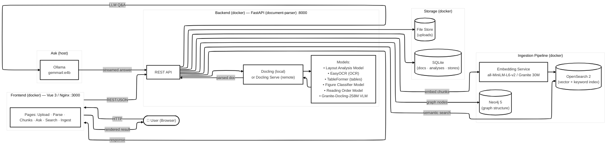

# Docling Studio - Team Customization

A customized document analysis studio for our team, powered by [Docling](https://github.com/DS4SD/docling). Upload PDFs, configure extraction pipelines, visualize results, and perform semantic search — all from your browser.

## Architecture



## Prerequisites

Before setting up the application, ensure you have the following installed:

- **Docker Desktop** (latest version recommended)
  - At least 8 GB RAM allocated to Docker
  - At least 4 CPUs allocated to Docker
- **Git** (for cloning the repository)
- **Ollama** (optional, for Ask functionality)
  - Install from [ollama.com](https://ollama.com/)
  - Pull and run the model: `ollama run gemma4:e4b`

## Setup

### 1. Clone the Repository

```bash
git clone https://github.com/silwaltz/docling-Studio.git
cd docling-Studio
```

### 2. Configure Environment Variables

Copy the example environment file and customize as needed:

```bash
cp .env.example .env
```

Key environment variables to review:
- `MAX_FILE_SIZE_MB` - Maximum upload file size (default: 50)
- `MAX_PAGE_COUNT` - Maximum pages per document (default: 0 = unlimited)
- `RATE_LIMIT_RPM` - Rate limit per IP (default: 100)
- `NEO4J_PASSWORD` - Neo4j password (default: changeme - **change this for production**)

### 3. Start the Application

For full development stack with all services:

```bash
docker compose -f docker-compose.dev.yml up -d
```

This starts:
- Frontend (Vue 3 dev server) on http://localhost:3000
- Backend (FastAPI) on http://localhost:8000
- Neo4j on http://localhost:7474
- OpenSearch on http://localhost:9200
- OpenSearch Dashboards on http://localhost:5601
- Embedding service on http://localhost:8001

### 4. Access the Application

Open your browser and navigate to: http://localhost:3000

### 5. Stop the Application

```bash
docker compose -f docker-compose.dev.yml down
```

To also remove volumes (clean slate):

```bash
docker compose -f docker-compose.dev.yml down -v
```

## Parsing Options and Expected Results

### Pipeline Options

Configure parsing options in the Studio UI. These control how Docling processes your documents:

**Pipeline Selection:**

| Option | Default | Description | Expected Result |
|--------|---------|-------------|-----------------|
| **VLM Pipeline** | `false` | Use VLM (Vision Language Model) pipeline instead of standard pipeline | Higher quality extraction for complex documents, slower processing |

**When VLM Pipeline is enabled:**

| Option | Default | Description | Expected Result |
|--------|---------|-------------|-----------------|
| **Resolution** | `4` (High) | Page render scale fed to VLM model: Fast (2x), Balanced (3x), High (4x), Max (5x) | Higher resolution reads smaller text but is slower |

**When VLM Pipeline is disabled (Standard Pipeline):**

| Option | Default | Description | Expected Result |
|--------|---------|-------------|-----------------|
| **OCR** | `true` | OCR for scanned pages and embedded images | Extracts text from images and scanned PDFs |
| **Force full-page OCR** | `false` | Force full-page OCR for scanned documents | Better text extraction from image-only PDFs |
| **Table extraction** | `true` | Table detection and row/column reconstruction | Tables extracted with proper cell structure |
| **Table mode** | `accurate` | `accurate` (TableFormer) or `fast` | Accurate: better table detection, slower; Fast: quicker, less accurate |

### Expected Output

After parsing, you'll receive:

1. **Markdown Content** - Full document text in Markdown format
2. **Structured JSON** - Complete document structure with:
   - Text elements with bounding boxes
   - Tables with cell contents
   - Images with metadata
   - Formulas in LaTeX
   - Page layout information
3. **Bounding Boxes** - Visual overlay on PDF showing element locations

### Performance Expectations

| Document type | Pages | Approx. time (CPU) |
|---------------|-------|---------------------|
| Simple report | 5–10  | ~30s–1 min |
| Research paper | 10–30 | ~1–2 min |
| Large document | 100+  | ~2–5 min |

> **Note:** First run is slower as ML models download (~400 MB). Subsequent runs are faster.

## Ask (Document Q&A)

The Ask feature allows you to ask questions about your uploaded documents using AI.

### Setup

1. **Install Ollama** (if not already installed):
   ```bash
   # On macOS/Linux
   curl -fsSL https://ollama.com/install.sh | sh

   # On Windows: Download from https://ollama.com/download
   ```

2. **Pull the required model**:
   ```bash
   ollama pull gemma4:e4b
   ```

3. **Verify Ollama is running**:
   ```bash
   ollama serve
   # In another terminal:
   ollama list
   ```

4. **Configure the backend**:
   The backend is pre-configured to use:
   - `OLLAMA_HOST=http://host.docker.internal:11434`
   - `CHAT_MODEL_ID=gemma4:e4b`

### Using Ask

1. Upload and parse a document
2. Navigate to the **Ask** tab
3. Type your question about the document
4. Receive AI-generated answers, if it return json format, will include a json download button

### How It Works

- The system uses the full document markdown as context
- Your question is sent to the LLM (Ollama) along with the document content
- The LLM generates an answer based on the provided context
- Answers are streamed back in real-time

### Troubleshooting Ask

If Ask doesn't work:

1. **Check Ollama is running**:
   ```bash
   ollama ps
   ```

2. **Verify the model is pulled**:
   ```bash
   ollama list
   ```

3. **Check backend logs**:
   ```bash
   docker compose -f docker-compose.dev.yml logs document-parser
   ```

4. **Test Ollama directly**:
   ```bash
   ollama run gemma4:e4b "Hello, can you hear me?"
   ```

## Additional Features

### Chunking

Split extracted content into semantic chunks:
- **Hierarchical** - Follows document structure (sections, paragraphs)
- **Hybrid** - Combines structure with token limits
- **Page-based** - Splits by page boundaries

Configure chunk size and overlap in the UI.

### Ingestion

Index chunks into OpenSearch for:
- Semantic search (vector-based)
- Keyword search (full-text)
- Hybrid search (combined)

Click **Ingest** in the Studio after parsing to index.

### Graph Storage

Document structure stored in Neo4j enables:
- Navigate document outline
- Find all tables under a section
- Trace chunks back to source elements
- Complex structural queries

Access Neo4j Browser at http://localhost:7474 (user: `neo4j`, password: from `.env`)

### Search

Full-text and vector search across indexed documents:
- Search by content
- Filter by document type
- Re-rank results by relevance

## Development

### Local Development (without Docker)

**Backend** (Python 3.12+):
```bash
cd document-parser
python -m venv .venv
source .venv/bin/activate  # On Windows: .venv\Scripts\activate
pip install -r requirements-local.txt
uvicorn main:app --reload --port 8000
```

**Frontend** (Node 20+):
```bash
cd frontend
npm install
npm run dev
```

### Running Tests

```bash
# Backend
cd document-parser
pip install pytest pytest-asyncio httpx
pytest tests/ -v

# Frontend
cd frontend
npm run test:run
```

## Configuration Reference

See [`.env.example`](.env.example) for all available configuration options.

Key settings:
- `CONVERSION_MODE` - `local` (in-process Docling) or `remote` (Docling Serve)
- `MAX_FILE_SIZE_MB` - Upload size limit
- `MAX_PAGE_COUNT` - Page count limit
- `RATE_LIMIT_RPM` - Rate limiting
- `CORS_ORIGINS` - Allowed frontend origins
- `NEO4J_PASSWORD` - Database password
- `OLLAMA_HOST` - Ollama endpoint for Ask feature

## Troubleshooting

### Containers won't start

```bash
# Check logs
docker compose -f docker-compose.dev.yml logs

# Rebuild containers
docker compose -f docker-compose.dev.yml up --build
```

### Out of memory errors

Increase Docker Desktop memory allocation to at least 8 GB.

### Slow parsing

- First run is slower (model downloads)
- Reduce `MAX_PAGE_COUNT` for large documents
- Use `table_mode: fast` for quicker table extraction

### Ask feature not working

- Verify Ollama is running: `ollama ps`
- Check model is pulled: `ollama list`
- Review backend logs for connection errors

## License

MIT - Based on [Docling Studio](https://github.com/scub-france/Docling-Studio) by Pier-Jean Malandrino
