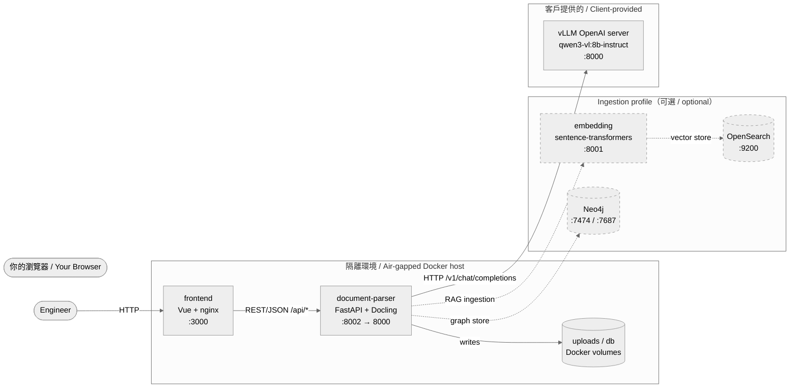
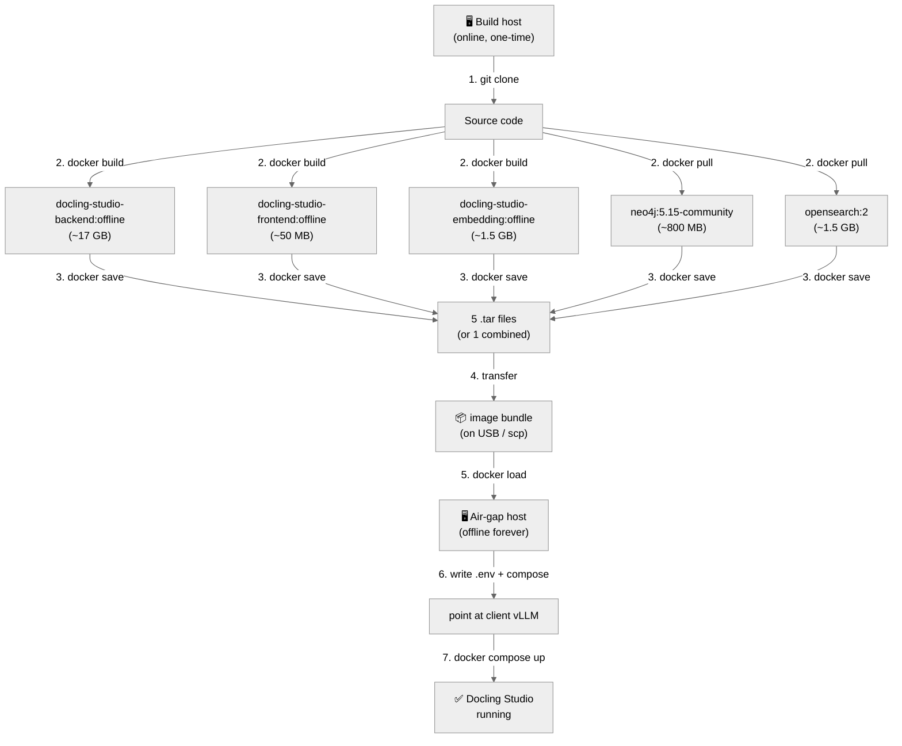

# Docling Studio — Air-Gapped Deployment Guide (中英對照)

> **Last verified against**: `docling-studio-backend:offline`, `docling-studio-frontend:offline`, `docling-studio-embedding:offline`, `neo4j:5.15-community`, `opensearchproject/opensearch:2` images, commit on `main` branch (2026-06-27).
> **Audience**: customer's deployment engineer. Junior-friendly — assumes Docker basics, no prior Docling / vLLM / Neo4j / OpenSearch experience.
> **Read time**: ~35 minutes. **Hands-on time**: ~2 hours (mostly waiting for Docker builds + image transfer).
> **Scope**: this guide covers the **full production system** — backend, frontend, embedding service, Neo4j, and OpenSearch. The vLLM container stays at the client side (out of scope for our image bundle).

---

## 目錄 / Table of Contents

1. [這份文件在做什麼 / What this guide does](#1-這份文件在做什麼--what-this-guide-does)
2. [架構總覽 / Architecture overview](#2-架構總覽--architecture-overview)
3. [前置準備 / Prerequisites](#3-前置準備--prerequisites)
4. [整體流程 / End-to-end flow](#4-整體流程--end-to-end-flow)
5. [步驟 1：複製專案 / Step 1: Clone the repo](#5-步驟-1複製專案--step-1-clone-the-repo)
6. [步驟 2：建立離線映像檔 / Step 2: Build the offline images](#6-步驟-2建立離線映像檔--step-2-build-the-offline-images)
7. [步驟 3：匯出映像檔成檔案 / Step 3: Export the images to files](#7-步驟-3匯出映像檔成檔案--step-3-export-the-images-to-files)
8. [步驟 4：傳輸到隔離環境 / Step 4: Transfer to the air-gapped environment](#8-步驟-4傳輸到隔離環境--step-4-transfer-to-the-air-gapped-environment)
9. [步驟 5：在隔離環境載入映像檔 / Step 5: Load the images on the air-gap host](#9-步驟-5在隔離環境載入映像檔--step-5-load-the-images-on-the-air-gap-host)
10. [步驟 6：建立部署目錄與環境檔 / Step 6: Set up the deployment directory and env file](#10-步驟-6建立部署目錄與環境檔--step-6-set-up-the-deployment-directory-and-env-file)
11. [步驟 7：啟動系統 / Step 7: Bring up the stack](#11-步驟-7啟動系統--step-7-bring-up-the-stack)
12. [步驟 8：驗證 / Step 8: Verify it works](#12-步驟-8驗證--step-8-verify-it-works)
13. [日常操作 / Day-2 operations](#13-日常操作--day-2-operations)
14. [常見問題 / Troubleshooting](#14-常見問題--troubleshooting)
15. [附錄 / Appendix](#15-附錄--appendix)

---

## 1. 這份文件在做什麼 / What this guide does

這份指南帶你從零開始，把 **Docling Studio 完整系統** 部署到**完全沒有外網**的 Docker 環境。

Docling Studio 由 **5 個容器**組成 — 我們 build 其中 3 個（backend / frontend / embedding），從 Docker Hub pull 另外 2 個官方 image（Neo4j / OpenSearch）。這份指南會教你把這 5 個 image 一起打包、搬到隔離環境、跑起來。

This guide walks you through deploying the **full Docling Studio system** into a **fully air-gapped** Docker environment.

Docling Studio is composed of **5 containers** — we build 3 from source (backend, frontend, embedding) and pull 2 official images (Neo4j, OpenSearch). This guide shows you how to bundle all 5 images, transfer them to the air-gapped host, and bring the stack up.

### 為什麼要這麼麻煩？/ Why this dance?

| 階段 / Phase | 需要網路？/ Internet needed? | 做什麼 / What happens |
|---|---|---|
| Build host | ✅ Yes (one-time) | Pull source code, download ML models, build / pull all 5 images |
| Image bundle | ❌ No | The bundle is self-contained — no model downloads at runtime |
| Air-gap host | ❌ No | Just runs the bundle. vLLM is provided by the client separately. |

Backend、embedding 跟 frontend 都在啟動或 build 時需要外網 — backend 第一次轉檔會去 Hugging Face 下載 Docling 模型，embedding 第一次啟動會下載 sentence-transformers 模型，frontend build 時會去 npm registry 拉套件。**沒有網路就會失敗**。我們的解法是：**build 階段就把所有東西烤進 image 裡**，runtime 永遠不再連外網。

The backend, the embedding service, and the frontend all need to reach external services at startup (backend → Hugging Face, embedding → sentence-transformers model hub, frontend → npm registry at build time). In an air-gapped environment, every one of these calls would fail. Our fix: **bake everything into the images at build time** — runtime never touches the network.

### 我們交付的 vs 客戶提供的 / What we ship vs. what the client provides

| 容器 / Container | 來源 / Source | 進 airgap image bundle 嗎？/ In our bundle? | 必需？/ Required? |
|---|---|---|---|
| `document-parser` (FastAPI + Docling) | 我們自建 / our Dockerfile | ✅ Yes | **必需 / Required** |
| `frontend` (Vue + nginx) | 我們自建 / our Dockerfile | ✅ Yes | **必需 / Required** |
| `embedding` (sentence-transformers) | 我們自建 / our Dockerfile | ✅ Yes | 只有用 ingestion profile 才需要 / only if using ingestion |
| `neo4j` (graph DB) | 官方 image / official `neo4j:5.15-community` | ✅ Yes | 只有用 ingestion profile 才需要 / only if using ingestion |
| `opensearch` (search) | 官方 image / official `opensearchproject/opensearch:2` | ✅ Yes | 只有用 ingestion profile 才需要 / only if using ingestion |
| `vllm` (Qwen3-VL) | 客戶提供 / client-provided | ❌ No — 客戶自己架 | 必需（由客戶部署）/ required (client hosts it) |
| `opensearch-dashboards` | 官方 image / official | ❌ No — **dev only** | 不需要 / not needed |

> 💡 **Ingestion profile 是什麼？/ What's the ingestion profile?** Neo4j / OpenSearch / embedding 構成一條 ingestion pipeline：把 PDF 切成 chunks → 用 embedding 算向量 → 存到 OpenSearch 跟 Neo4j 提供搜尋跟圖查詢。如果你只需要上傳 → 轉檔 → Ask，**這 3 個容器都不用建**。詳見 [15.6 附錄：只跑核心服務 / Appendix: core-only deployment](#156-附錄只跑核心服務--appendix-core-only-deployment)。

> 💡 **What's the ingestion profile?** Neo4j + OpenSearch + embedding form the ingestion pipeline: split PDFs into chunks → embed with sentence-transformers → store vectors in OpenSearch and graph in Neo4j for search and graph queries. If you only need upload → parse → Ask, **you don't need these 3 containers at all**. See [15.6 Appendix: core-only deployment](#156-附錄只跑核心服務--appendix-core-only-deployment).

---

## 2. 架構總覽 / Architecture overview

部署完成後，你的 air-gap 環境裡會跑這些容器（依賴 ingestion profile 與否）：

After deployment, your air-gap environment runs these containers (depending on whether you enable the ingestion profile):



**重要**：
- `vLLM` 是客戶自己架的（不在我們的 image bundle 裡）。後端只透過 HTTP 跟它講話。
- **實線** 是核心路徑（upload + parse + Ask）。**虛線** 是 ingestion profile（只有用搜尋 / 圖查詢才需要）。
- 連線箭頭方向 = **誰呼叫誰**，不是資料流向。

**Important**:
- `vLLM` is hosted by the client (NOT inside our image bundle). The backend talks to it over HTTP.
- **Solid arrows** are the core path (upload + parse + Ask). **Dashed arrows** are the ingestion profile (only needed for search / graph queries).
- Arrows show **who calls whom**, not data flow.

---

## 3. 前置準備 / Prerequisites

### 3.1 你會用到兩台機器 / You need two machines

| 機器 / Machine | 作業系統 / OS | 需要什麼 / What's needed |
|---|---|---|
| **Build host**（有網路） | Linux / macOS / Windows + WSL2 | Docker 24+, Git, **~30 GB 可用磁碟**, **能上網** |
| **Air-gap host**（隔離環境） | Linux（建議）/ Windows Server + Docker Desktop | Docker 24+, **~25 GB 可用磁碟**, **不能上網** |

> 💡 **Why two machines?** The build host needs internet exactly once to download ML models + pull official images. Once the bundle is baked, it never needs the network again. The air-gap host never needs internet at all — it only talks to the client-hosted vLLM over your internal network.

### 3.2 工具確認 / Verify your tools

在 build host 上執行 / Run on the **build host**:

```bash
# Linux / macOS / WSL2 (bash)
docker --version       # 期望 >= 24.0  / expect >= 24.0
git --version          # 任何版本  / any version
df -h .                # 至少有 30 GB 可用  / at least 30 GB free
```

```powershell
# Windows (PowerShell)
docker --version
git --version
Get-PSDrive C | Select-Object Used,Free
```

### 3.3 客戶會提供給你 / What the client provides

| 項目 / Item | 說明 / Description | 範例 / Example |
|---|---|---|
| vLLM endpoint URL | OpenAI 相容 API 的網址 / OpenAI-compatible API URL | `http://vllm-client.internal:8000/v1` |
| vLLM model name | vLLM 對外宣稱的模型別名 / Alias served by vLLM | `qwen3-vl:8b-instruct` |
| （選用）Neo4j 密碼 / Neo4j password | 圖資料庫密碼 / Graph DB password（**airgap 環境會重設，不要用 default**） | `<由客戶提供>` |

> ⚠️ **重要**：`vLLM model name` 必須是 `qwen3-vl:8b-instruct`（不是 `qwen3-vl:8b`）。少了 `-instruct` 後綴，模型會輸出推理而不給答案。詳見後面的「常見問題」。
>
> ⚠️ **Important**: The `vLLM model name` MUST be `qwen3-vl:8b-instruct` (NOT `qwen3-vl:8b`). Without the `-instruct` suffix, the model dumps reasoning instead of giving an answer. See "Troubleshooting" below.

### 3.4 檔案傳輸通道 / File transfer channel

整個 image bundle 解壓縮後約 **~22 GB**（5 個 image 加在一起），壓縮後約 **~10 GB**。把 bundle 從 build host 搬到 air-gap host。常用方式：

The full image bundle is about **~22 GB uncompressed** (~10 GB after `gzip`). Common transfer channels:

| 方式 / Method | 適用場景 / When to use |
|---|---|
| USB 隨身碟 / USB stick | 實體隔離、無網路連線 / Physically isolated, no network |
| 內網 `scp` / `rsync` | 兩台機器在同一個內網 / Both hosts on the same internal network |
| 共用檔案伺服器 / Shared file server | air-gap host 能讀到內部 NAS / air-gap host can read an internal NAS |

> 💡 **建議 / Recommendation**: 用 `sha256sum` 算一下 hash，傳完在另一邊再算一次，確認檔案沒損壞。bundle 越大越容易在 USB 傳輸中出錯。

> 💡 **Recommended**: Compute the SHA-256 hash before and after transfer to verify integrity. Larger bundles are more prone to USB transfer errors.

---

## 4. 整體流程 / End-to-end flow



---

## 5. 步驟 1：複製專案 / Step 1: Clone the repo

> 在 **build host** 上做 / Do this on the **build host**.

```bash
git clone <REPO_URL> docling-studio
cd docling-studio
```

把 `<REPO_URL>` 換成客戶（或你的 Git server）給你的網址。

Replace `<REPO_URL>` with the address your Git admin gave you.

**驗證 / Verify**:

```bash
ls -1
# 你應該看到 / You should see:
#   Dockerfile  document-parser  docker-compose.yml  frontend  embedding-service  ...
```

> 💡 **為什麼要 clone 整包？/ Why clone the whole repo?** 我們要 build 3 個 image — backend（從 `document-parser/`）、frontend（從 `frontend/`）、embedding（從 `embedding-service/`）。每個 image 都需要對應子目錄裡的原始碼 + Dockerfile。

> 💡 **Why the whole repo?** We build 3 images — backend (from `document-parser/`), frontend (from `frontend/`), embedding (from `embedding-service/`). Each image needs the source + Dockerfile in its subdirectory.

---

## 6. 步驟 2：建立離線映像檔 / Step 2: Build the offline images

> 在 **build host** 上做（需要網路，僅此一次）/ Do this on the **build host** (needs internet, one time only).

我們要產出 **5 個 image**。3 個自己 build，2 個從 Docker Hub pull。

We'll produce **5 images**. 3 we build, 2 we pull from Docker Hub.

| # | Image | 來源 / Source | 大小 / Size | 一定要？/ Required? |
|---|---|---|---|---|
| 1 | `docling-studio-backend:offline` | 自建 / build | ~17 GB | **Yes** |
| 2 | `docling-studio-frontend:offline` | 自建 / build | ~50 MB | **Yes** |
| 3 | `docling-studio-embedding:offline` | 自建 / build | ~1.5 GB | 只有 ingestion profile / only if ingestion |
| 4 | `neo4j:5.15-community` | pull | ~800 MB | 只有 ingestion profile / only if ingestion |
| 5 | `opensearchproject/opensearch:2` | pull | ~1.5 GB | 只有 ingestion profile / only if ingestion |

### 6.1 Build #1: `docling-studio-backend:offline`（最大、最慢）

```bash
docker build \
    --target local \
    -t docling-studio-backend:offline \
    -f document-parser/Dockerfile \
    document-parser/
```

**參數說明 / What the flags mean**:

| 旗標 / Flag | 用途 / Purpose |
|---|---|
| `--target local` | 用 Docling **in-process** 那個 build target（不是 remote 那個） |
| `-t docling-studio-backend:offline` | 給 image 一個好認的名字和 tag |
| `-f document-parser/Dockerfile` | 指定 backend 的 Dockerfile |
| `document-parser/` | build context（最後那個路徑） |

第一次 build 需要 **15–40 分鐘**，因為會下載 ~1.5 GB 的 Docling 模型。你會看到一連串 `[docling-bake]` 開頭的訊息 — 那是模型下載的進度。

The first build takes **15–40 minutes** because it downloads ~1.5 GB of Docling models. You'll see lines starting with `[docling-bake]` — that's the model download progress.

> 💡 **耐心點 / Be patient**: 不要中斷 build。中斷的話下次 build 要從頭來。

> 💡 **Be patient**: don't interrupt. An interrupted build has to restart from scratch.

**驗證 backend image 內含模型 / Verify the backend image has the models baked in**:

```bash
docker run --rm docling-studio-backend:offline \
    ls -1 /opt/docling/models
```

**預期輸出 / Expected output**（節錄 / excerpt）:

```
ds4sd--docling-models
EasyOcr
ds4sd--CodeFormula
ds4sd--pic2doc
...
```

如果目錄是空的或報錯，回去檢查 build log。

If the directory is empty or errors out, go back and check the build log.

**確認 backend image 沒有對外連線 / Confirm no network calls at runtime**:

```bash
docker run --rm --network=none docling-studio-backend:offline \
    python -c "from docling.document_converter import DocumentConverter; \
    c = DocumentConverter(); print('converter built OK, no network needed')"
```

**預期輸出 / Expected**: `converter built OK, no network needed`。

如果出現 `downloads disabled` 或 timeout 訊息，代表模型沒正確烤入，**不要繼續**，回去查 build log。

If you see `downloads disabled` or timeouts, the models weren't baked in correctly — **don't proceed**, go back to the build log.

### 6.2 Build #2: `docling-studio-frontend:offline`

```bash
docker build \
    -t docling-studio-frontend:offline \
    -f frontend/Dockerfile \
    frontend/
```

這個 build 需要 **3–8 分鐘**（`npm ci` + `npm run build`，第一次會拉所有套件）。之後會用 nginx 跑靜態檔。

This build takes **3–8 minutes** (`npm ci` + `npm run build` — first run pulls every package). The result is an nginx image serving static files.

**驗證 frontend image 含有靜態檔 / Verify the frontend image has the static build**:

```bash
docker run --rm docling-studio-frontend:offline \
    ls /usr/share/nginx/html | head -5
# 預期 / Expected: assets  favicon.ico  index.html  ...
```

### 6.3 Build #3: `docling-studio-embedding:offline`（只有 ingestion profile 才需要）

只有當你要用 ingestion（搜尋、圖查詢、RAG）才需要這個 image。**純 Ask 場景可以跳過這步。**

You only need this image if you're using the ingestion profile (search, graph queries, RAG). **Skip this step for a parse + Ask-only deployment.**

```bash
docker build \
    -t docling-studio-embedding:offline \
    -f embedding-service/Dockerfile \
    embedding-service/
```

第一次 build 需要 **5–15 分鐘**（`pip install sentence-transformers` + 把預設模型烤進 image）。後續 rebuild 會快很多（Docker layer cache）。

First build takes **5–15 minutes** (`pip install sentence-transformers` + baking the default model into the image). Subsequent rebuilds are much faster (Docker layer cache).

> 💡 **換模型 / Using a different model**: 如果客戶要求用 `Granite-Embedding-30M` 這類比較大的模型，把 `EMBEDDING_MODEL` 用 build-arg 傳進去：
>
> ```bash
> docker build \
>     --build-arg EMBEDDING_MODEL=ibm-granite/granite-embedding-30m-english \
>     -t docling-studio-embedding:offline \
>     -f embedding-service/Dockerfile \
>     embedding-service/
> ```
>
> ⚠️ 換模型會讓 image 大小從 1.5 GB 漲到 3 GB 左右。

> 💡 **Different model**: To use a different model like `Granite-Embedding-30M`, pass `EMBEDDING_MODEL` as a build-arg. ⚠️ Larger models (3 GB) will inflate the image.

**驗證 embedding image 含有模型 / Verify the embedding image has the model baked in**:

```bash
docker run --rm docling-studio-embedding:offline \
    python -c "from sentence_transformers import SentenceTransformer; \
    m = SentenceTransformer('all-MiniLM-L6-v2'); print('model loaded:', m.get_sentence_embedding_dimension(), 'dims')"
```

**預期輸出 / Expected**: `model loaded: 384 dims`。

### 6.4 Pull #4: `neo4j:5.15-community`（只有 ingestion profile 才需要）

```bash
docker pull neo4j:5.15-community
```

只有 **~800 MB**，pull 速度看網路而定（通常 1–3 分鐘）。

About **~800 MB** — pull time depends on your network (typically 1–3 minutes).

### 6.5 Pull #5: `opensearchproject/opensearch:2`（只有 ingestion profile 才需要）

```bash
docker pull opensearchproject/opensearch:2
```

約 **~1.5 GB**。OpenSearch image 較大，pull 可能要 3–10 分鐘。

About **~1.5 GB** — OpenSearch is a larger image, expect 3–10 minutes.

### 6.6 確認所有 image 都建好 / Verify all images are present

```bash
docker images \
    --filter reference=docling-studio-backend \
    --filter reference=docling-studio-frontend \
    --filter reference=docling-studio-embedding \
    --filter reference=neo4j \
    --filter reference=opensearchproject/opensearch
```

**預期 / Expected**（視你有沒有跑 ingestion profile，數量 3 或 5）:

```
REPOSITORY                       TAG               SIZE
docling-studio-backend           offline           17GB
docling-studio-frontend          offline           50MB
docling-studio-embedding         offline           1.5GB
neo4j                            5.15-community    800MB
opensearchproject/opensearch     2                 1.5GB
```

如果有任何一個 row 缺，代表 build / pull 中途失敗。

If any row is missing, the build / pull failed midway.

---

## 7. 步驟 3：匯出映像檔成檔案 / Step 3: Export the images to files

> 在 **build host** 上做 / Do this on the **build host**.

把每個 image `docker save` 成獨立 .tar。**每個 image 一個檔案**，方便管理跟部分重傳（例如下次只更新 frontend）。

Save each image as its own .tar. **One file per image** so you can re-transfer just one if it changes.

### 7.1 建立 bundle 目錄 / Create a bundle directory

```bash
mkdir -p docling-studio-bundle
cd docling-studio-bundle
```

### 7.2 匯出所有 image / Export every image

```bash
# Linux / macOS / WSL2
docker save -o backend.tar          docling-studio-backend:offline
docker save -o frontend.tar         docling-studio-frontend:offline
docker save -o embedding.tar        docling-studio-embedding:offline     # 只有 ingestion / only if ingestion
docker save -o neo4j.tar            neo4j:5.15-community                  # 只有 ingestion / only if ingestion
docker save -o opensearch.tar       opensearchproject/opensearch:2        # 只有 ingestion / only if ingestion
```

```powershell
# Windows (PowerShell) — 同樣的指令 / same commands
docker save -o backend.tar          docling-studio-backend:offline
docker save -o frontend.tar         docling-studio-frontend:offline
docker save -o embedding.tar        docling-studio-embedding:offline
docker save -o neo4j.tar            neo4j:5.15-community
docker save -o opensearch.tar       opensearchproject/opensearch:2
```

### 7.3 壓縮 / Compress

```bash
# Linux / macOS / WSL2
gzip *.tar
# 最終檔案 / Final files:
#   backend.tar.gz       (~7-9 GB)
#   frontend.tar.gz      (~25 MB)
#   embedding.tar.gz     (~600 MB)
#   neo4j.tar.gz         (~350 MB)
#   opensearch.tar.gz    (~600 MB)
```

```powershell
# Windows (PowerShell) — 用 7-Zip 或內建 / use 7-Zip or built-in
# 範例：用 7-Zip / Example: 7-Zip
foreach ($f in Get-ChildItem *.tar) {
    7z a "$($f.Name).gz" $f.Name
    Remove-Item $f.Name
}
# 最終檔案同 Linux / Same final filenames as Linux
```

> 💡 **為什麼分開存？/ Why save them separately?** 升級時通常只動一兩個 image（例如只改 frontend），分開存可以只重傳有改的那幾個 .tar，USB 寫入時間從「小時級」降到「分鐘級」。

> 💡 **Why save separately?** Upgrades usually touch one or two images (e.g. just the frontend). Saving separately means re-transferring just the changed .tar files — going from hours of USB write to minutes.

### 7.4 驗證匯出成功 / Verify export success

```bash
ls -lh
# 應該看到 3 或 5 個 .tar.gz 檔 / Should see 3 or 5 .tar.gz files
# 總和約 8-11 GB / Total ~8-11 GB
```

---

## 8. 步驟 4：傳輸到隔離環境 / Step 4: Transfer to the air-gapped environment

依照你的基礎設施選一個 / Pick one based on your infrastructure:

| 方式 / Method | 指令 / Command |
|---|---|
| USB 隨身碟 / USB stick | 把 .tar.gz 複製到 USB，再插到 air-gap host |
| `scp` 內網傳輸 / `scp` over internal network | `scp *.tar.gz user@airgap-host:/tmp/` |
| 共用檔案伺服器 / Shared file server | 複製到 air-gap host 能讀到的路徑，例如 `\\fileserver\deploy\` |

> 💡 **建議 / Recommendation**: 用 `sha256sum` 算一下每個檔案的 hash，傳完在另一邊再算一次，確認檔案沒損壞。bundle 越大越容易在 USB 傳輸中出錯。

> 💡 **Recommended**: Compute the SHA-256 hash of every file before and after transfer to verify integrity. Larger bundles are more prone to USB transfer errors.

```bash
# Build host
sha256sum *.tar.gz > bundle.sha256
# 抄下 / Note down these hashes
```

在 air-gap host 上 / On the air-gap host:

```bash
sha256sum -c bundle.sha256
# 應該全部 "OK" / Should all say "OK"
```

---

## 9. 步驟 5：在隔離環境載入映像檔 / Step 5: Load the images on the air-gap host

> 在 **air-gap host** 上做 / Do this on the **air-gap host**.

### 9.1 解壓縮 / Decompress

```bash
# Linux / macOS
gunzip -k *.tar.gz
```

```powershell
# Windows (PowerShell) — 用 7-Zip 解壓 / use 7-Zip
foreach ($f in Get-ChildItem *.tar.gz) {
    7z x $f.Name
    Remove-Item $f.Name
}
```

### 9.2 載入所有 image / Load every image

```bash
# Linux / macOS
docker load -i backend.tar
docker load -i frontend.tar
docker load -i embedding.tar     # 只有 ingestion / only if ingestion
docker load -i neo4j.tar         # 只有 ingestion / only if ingestion
docker load -i opensearch.tar    # 只有 ingestion / only if ingestion
# 刪除 .tar 釋放磁碟 / Delete .tar files to reclaim disk
rm *.tar
```

```powershell
# Windows (PowerShell) — 同樣的指令 / same commands
docker load -i backend.tar
docker load -i frontend.tar
docker load -i embedding.tar
docker load -i neo4j.tar
docker load -i opensearch.tar
Remove-Item *.tar
```

### 9.3 驗證所有 image 都載入 / Verify all images are loaded

```bash
docker images \
    --filter reference=docling-studio-backend \
    --filter reference=docling-studio-frontend \
    --filter reference=docling-studio-embedding \
    --filter reference=neo4j \
    --filter reference=opensearchproject/opensearch
```

預期看到的 row 數跟 step 6.6 一樣（3 或 5）。

You should see the same rows as in step 6.6 (3 or 5).

---

## 10. 步驟 6：建立部署目錄與環境檔 / Step 6: Set up the deployment directory and env file

> 在 **air-gap host** 上做 / Do this on the **air-gap host**.

### 10.1 建立部署目錄 / Create a deployment directory

```bash
sudo mkdir -p /opt/docling-studio
sudo chown $USER:$USER /opt/docling-studio
cd /opt/docling-studio
```

### 10.2 準備必要的 compose 檔 / Prepare the necessary compose file

把 `docker-compose.yml` 從 build host 複製過來（air-gap host 沒辦法 `git clone`）。**最小需求** 就是這個檔案 + 一份 `.env`：

Copy `docker-compose.yml` from the build host (the air-gap host can't `git clone`). **Minimum requirement** is this file + a `.env`:

| 必要檔案 / Required file | 用途 / Purpose |
|---|---|
| `docker-compose.yml` | 主 compose 檔 / Main compose file |
| `.env` | 環境變數 / Env vars（你建立 / you create this） |

> ⚠️ **Airgap 修改 / Airgap tweak**: 我們需要把 compose 裡所有 `build:` context 換成 `image:`，因為 air-gap host 不能 build。要修改的欄位在下方範本裡標了 ✅ 註解。

> ⚠️ **Airgap tweak**: We need to replace every `build:` context in the compose with `image:`, because the air-gap host can't build. The fields to change are marked with ✅ comments in the template below.

### 10.3 建立 `docker-compose.yml`（airgap 版）/ Create `docker-compose.yml` (airgap version)

存成 `/opt/docling-studio/docker-compose.yml`：

Save as `/opt/docling-studio/docker-compose.yml`:

```yaml
# =============================================================================
# Docling Studio — Air-gap deployment
# 所有 image 都用 image: 而不是 build:（air-gap host 不能 build）
# All services use image: (no build:) — air-gap host cannot build.
# 客戶提供 vLLM，本機不跑任何 LLM 容器。
# Client provides vLLM, no LLM container runs locally.
# =============================================================================
services:
  # --- Backend (FastAPI) ---
  # ✅ airgap change: build: → image:
  document-parser:
    image: docling-studio-backend:offline   # 從 build host 載入 / loaded from build host
    container_name: docling-studio-backend
    restart: unless-stopped
    expose:
      - "8000"   # 只有 frontend nginx 才需要連到 / only frontend nginx needs to reach this
    ports:
      - "8002:8000"   # 對外開 8002 給 debug，避免與客戶的 vLLM :8000 衝突 / use 8002 to avoid clashing with client vLLM :8000
    volumes:
      - uploads_data:/app/uploads
      - db_data:/app/data
    env_file:
      - .env
    healthcheck:
      test: ["CMD-SHELL", "curl -sf http://localhost:8000/api/health || exit 1"]
      interval: 30s
      timeout: 10s
      retries: 5
      start_period: 60s

  # --- Frontend ---
  # ✅ airgap change: build: → image:
  frontend:
    image: docling-studio-frontend:offline   # 從 build host 載入 / loaded from build host
    container_name: docling-studio-frontend
    restart: unless-stopped
    ports:
      - "3000:80"
    depends_on:
      document-parser:
        condition: service_healthy

  # --- Ingestion profile（可選 / optional）---
  # 不用 ingestion 的客戶把整個 block 刪掉 / Customers not using ingestion can delete this whole block.
  embedding:
    image: docling-studio-embedding:offline  # ✅ airgap change
    container_name: docling-studio-embedding
    restart: unless-stopped
    expose:
      - "8001"
    environment:
      EMBEDDING_MODEL: ${EMBEDDING_MODEL:-all-MiniLM-L6-v2}
      EMBEDDING_BATCH_SIZE: ${EMBEDDING_BATCH_SIZE:-64}
    healthcheck:
      test: ["CMD-SHELL", "curl -sf http://localhost:8001/health || exit 1"]
      interval: 15s
      timeout: 10s
      retries: 5
      start_period: 60s
    deploy:
      resources:
        limits:
          memory: 2g

  opensearch:
    image: opensearchproject/opensearch:2   # ✅ airgap change (pulled on build host)
    container_name: docling-studio-opensearch
    restart: unless-stopped
    environment:
      discovery.type: single-node
      # ⚠️ 這是 dev-only 設定。Production 請參考
      # https://opensearch.org/docs/latest/security/configuration/ 開啟 security plugin
      DISABLE_SECURITY_PLUGIN: "true"
      OPENSEARCH_JAVA_OPTS: "-Xms512m -Xmx512m"
    ulimits:
      memlock:
        soft: -1
        hard: -1
    volumes:
      - opensearch_data:/usr/share/opensearch/data
    healthcheck:
      test: ["CMD-SHELL", "curl -sf http://localhost:9200/_cluster/health || exit 1"]
      interval: 10s
      timeout: 5s
      retries: 10
      start_period: 30s

  neo4j:
    image: neo4j:5.15-community              # ✅ airgap change (pulled on build host)
    container_name: docling-studio-neo4j
    restart: unless-stopped
    stop_grace_period: 60s
    environment:
      NEO4J_AUTH: ${NEO4J_USER:-neo4j}/${NEO4J_PASSWORD:?NEO4J_PASSWORD is required}
      NEO4J_server_memory_heap_initial__size: 512m
      NEO4J_server_memory_heap_max__size: 1g
    volumes:
      - neo4j_data:/data
      - neo4j_logs:/logs
    healthcheck:
      test: ["CMD-SHELL", "cypher-shell -u $${NEO4J_USER:-neo4j} -p $${NEO4J_PASSWORD} 'RETURN 1' || exit 1"]
      interval: 10s
      timeout: 5s
      retries: 10
      start_period: 30s

volumes:
  uploads_data:
  db_data:
  opensearch_data:
  neo4j_data:
  neo4j_logs:
```

> 💡 **只跑核心服務？/ Core-only?** 如果你不要 ingestion，刪掉 `embedding` / `opensearch` / `neo4j` 三個 service + 對應的 `volumes` + 從 `.env` 移除 `OPENSEARCH_URL` / `EMBEDDING_URL` / `NEO4J_URI` 設定。詳見 [15.6](#156-附錄只跑核心服務--appendix-core-only-deployment)。

> 💡 **Core-only?** If you don't need ingestion, delete the `embedding` / `opensearch` / `neo4j` services + their volumes, and remove `OPENSEARCH_URL` / `EMBEDDING_URL` / `NEO4J_URI` from `.env`. See [15.6](#156-附錄只跑核心服務--appendix-core-only-deployment).

### 10.4 建立 `.env` 檔 / Create the `.env` file

把下面的範本存成 `/opt/docling-studio/.env`，然後**填入客戶給你的真實值**：

Save the template below as `/opt/docling-studio/.env`, then **fill in the real values from the client**:

```dotenv
# =============================================================================
# Docling Studio — Air-gap production .env
# 必填的欄位都已用 <ANGLE_BRACKETS> 標示。沒標示的保留預設即可。
# Required fields are marked with <ANGLE_BRACKETS>. Leave others at default.
# =============================================================================

# --- vLLM (客戶提供 / client-provided) ----------------------------------------
# 客戶給你的 vLLM OpenAI 相容 API URL（含 /v1）
# The vLLM OpenAI-compatible API URL the client gave you (include /v1)
OPENAI_BASE_URL=<CLIENT_VLLM_URL>/v1

# VLM 路徑。預設跟 OPENAI_BASE_URL 一樣，但有些客戶會把 VLM 開在不同 port。
# VLM endpoint. Same as chat by default, but the client may expose VLM on a different port.
VLM_OPENAI_URL=<CLIENT_VLLM_URL>/v1/chat/completions

# vLLM 對外宣稱的模型名稱 — 必須完全等於 qwen3-vl:8b-instruct
# Model alias served by vLLM — must equal qwen3-vl:8b-instruct exactly
CHAT_MODEL_ID=qwen3-vl:8b-instruct

# 用 OpenAI 相容模式（不要改成 ollama）/ Use OpenAI-compat mode (do not change to ollama)
CHAT_PROVIDER=openai

# vLLM 通常不需要 API key；如有，客戶會提供 / Most vLLM servers don't need a key; client will provide if needed
OPENAI_API_KEY=

# --- Docling model artifacts（已烤進 image，不需改）-----------------------------
# Docling model artifacts (baked into image, no change needed)
DOCLING_ARTIFACTS_PATH=/opt/docling/models

# --- 部署設定 / Deployment settings --------------------------------------------
# 對外開放 CORS 的來源；改成你的瀏覽器會用的網址
# Allowed CORS origins; set to the URL your browser will use
CORS_ORIGINS=http://localhost:3000

# 上傳檔案大小上限 / Max upload size in MB
MAX_FILE_SIZE_MB=50

# 單次轉檔逾時秒數 / Per-conversion timeout in seconds
CONVERSION_TIMEOUT=3600

# Fernet 密鑰（用來加密儲存的憑證）。生成方式見註解。
# Fernet key for store-credential encryption. Generate as shown in the comment.
#   python -c "from cryptography.fernet import Fernet; print(Fernet.generate_key().decode())"
STORE_SECRET_KEY=<RUN_PYTHON_ONELINE_TO_GENERATE>

# --- VLM 設定 / VLM settings ---------------------------------------------------
VLM_BACKEND=ollama
VLM_OLLAMA_MODEL=qwen3-vl:8b-instruct

# --- Ingestion profile（只有用 ingestion 才需要 / only if using ingestion）----
# 留空 = 整個 ingestion 關閉。NEO4J_PASSWORD 一定要設。
# Leave empty = ingestion disabled. NEO4J_PASSWORD must be set if you enabled
# the neo4j/opensearch/embedding services in docker-compose.yml.
#
# OPENSEARCH_URL=http://opensearch:9200
# EMBEDDING_URL=http://embedding:8001
# NEO4J_URI=bolt://neo4j:7687
# NEO4J_USER=neo4j
# NEO4J_PASSWORD=<SET_A_REAL_PASSWORD_HERE>
# EMBEDDING_MODEL=all-MiniLM-L6-v2
```

### 10.5 怎麼生成 STORE_SECRET_KEY / How to generate STORE_SECRET_KEY

這個 key 用來加密存在資料庫裡的憑證（如果有設定 OpenSearch / Neo4j 連線的話）。**必須保持穩定**，換了 key 會讓舊資料無法解密。

This key encrypts stored credentials (e.g. OpenSearch / Neo4j credentials). **Must stay stable** — changing it invalidates all old data.

**如果 air-gap host 完全沒裝 Python**：在 build host 上跑一次，把輸出貼過來。

**If the air-gap host has no Python**: run once on the build host and paste the output.

```bash
# 在 build host（有 Python 的任何地方）上
python -c "from cryptography.fernet import Fernet; print(Fernet.generate_key().decode())"
```

會得到類似 / You'll get something like:

```
b'kFm9X2vN8pQ3rT6yU4wZ1aB5cD7eF0gH='
```

把這個字串貼到 `.env` 的 `STORE_SECRET_KEY=` 後面。**找個地方備份**，未來重 deploy 時需要同一把 key。

Paste that string after `STORE_SECRET_KEY=` in `.env`. **Back it up somewhere** — future re-deployments need the same key.

### 10.6 確認檔案結構 / Confirm the directory layout

```bash
ls -la /opt/docling-studio/
# 應該看到 / Should see:
#   docker-compose.yml
#   .env
# (兩個檔案就夠了 / just two files is enough)
```

---

## 11. 步驟 7：啟動系統 / Step 7: Bring up the stack

> 在 **air-gap host** 上做 / Do this on the **air-gap host**.

### 11.1 啟動 / Bring up

```bash
cd /opt/docling-studio

# 啟動完整系統（含 ingestion profile）/ Bring up full system (with ingestion profile)
docker compose up -d

# 只跑核心（已刪除 ingestion services）/ Core-only (after deleting ingestion services)
# docker compose up -d
```

### 11.2 看 log / Tail logs

```bash
# 全部 / All
docker compose logs -f

# 只看 backend / Just backend
docker compose logs -f document-parser
```

> 第一次啟動時，**backend 載入 Docling 模型到記憶體**需要 30–60 秒、**OpenSearch 啟動 JVM**需要 30–60 秒、**Neo4j 啟動 graph DB**需要 20–40 秒 — 都是正常的，不要急著重啟。

> First boot takes time: **backend loads Docling models into RAM** (30–60 s), **OpenSearch boots the JVM** (30–60 s), **Neo4j initializes the graph DB** (20–40 s). All normal — don't restart prematurely.

### 11.3 驗證 container 健康 / Verify container health

```bash
docker compose ps
```

**預期 / Expected**（完整部署 / full deployment）:

```
NAME                          STATUS                    PORTS
docling-studio-backend        Up (healthy)              0.0.0.0:8002->8000/tcp
docling-studio-frontend       Up                        0.0.0.0:3000->80/tcp
docling-studio-embedding      Up (healthy)              8001/tcp
docling-studio-opensearch     Up (healthy)              9200/tcp
docling-studio-neo4j          Up (healthy)              7474/tcp, 7687/tcp
```

**預期 / Expected**（core-only / core-only）:

```
NAME                          STATUS                    PORTS
docling-studio-backend        Up (healthy)              0.0.0.0:8002->8000/tcp
docling-studio-frontend       Up                        0.0.0.0:3000->80/tcp
```

> 💡 看到 `Up` 但還沒 `healthy` 是正常的 — healthcheck 跑完一輪要 30 秒。

> 💡 `Up` without `healthy` is normal — the first healthcheck round takes ~30 s.

---

## 12. 步驟 8：驗證 / Step 8: Verify it works

### 12.1 Backend health check

```bash
curl http://localhost:8002/api/health
# 預期 / Expected: {"status":"ok",...}
```

### 12.2 確認 backend 可以連到客戶的 vLLM / Confirm backend can reach the client's vLLM

```bash
# 進 backend container 看一眼
docker exec docling-studio-backend env | grep -E "OPENAI_BASE_URL|VLM_OPENAI"
# 應該看到你剛剛填的 URL / Should show the URL you just filled in
```

### 12.3 各服務獨立健康檢查 / Per-service health check

**Backend (FastAPI)**:

```bash
curl http://localhost:8002/api/health
# {"status":"ok",...}
```

**OpenSearch** (如果有啟用 / if enabled):

```bash
curl -s http://localhost:9200/_cluster/health | head -c 200
# {"cluster_name":"docker-cluster","status":"green" or "yellow",...}
```

**Neo4j** (如果有啟用 / if enabled):

```bash
# 用 cypher-shell（容器內）
docker exec docling-studio-neo4j cypher-shell -u neo4j -p "$NEO4J_PASSWORD" "RETURN 1"
# 1
# (1 row)
```

**Embedding service** (如果有啟用 / if enabled):

```bash
docker exec docling-studio-embedding curl -s http://localhost:8001/health
# {"status":"ok"}
```

### 12.4 開瀏覽器 / Open the browser

打開 / Open: **http://localhost:3000**

應該看到 Docling Studio 的上傳頁面。試著上傳一個小 PDF（5 頁以內），確認能正常轉檔。

You should see Docling Studio's upload page. Try uploading a small PDF (≤ 5 pages) and confirm it converts normally.

### 12.5 測試 Ask 功能 / Test the Ask feature

1. 上傳並解析一個 PDF / Upload and parse a PDF
2. 切到 **Ask** tab / Switch to the **Ask** tab
3. 輸入一個問題，例如 "summarize this document" / Ask a question like "summarize this document"
4. 確認收到 stream 回來的答案 / Confirm you get a streamed answer

如果 ask 沒回應，去 backend log 看有沒有 vLLM connection 錯誤。

If Ask doesn't respond, check the backend log for vLLM connection errors.

### 12.6 測試 ingestion profile（如果啟用）/ Test the ingestion profile (if enabled)

1. 在 Settings 加一個 store 連線（Neo4j 或 OpenSearch）
2. 上傳一個 PDF，在分析後選 "Ingest"
3. 切到 Search tab，搜尋文件內容 — 應該找得到
4. 切到 Graph tab — 應該看到 entity graph

If any of these fail, check the relevant service log (`docker compose logs opensearch` / `neo4j` / `embedding`).

---

## 13. 日常操作 / Day-2 operations

### 13.1 停機 / Shut down

```bash
cd /opt/docling-studio
docker compose down
# 想連上傳和資料庫一起清掉的話 / To also wipe uploads and DB:
docker compose down -v
```

### 13.2 升級到新版本 / Upgrade to a new version

大多數升級只動一兩個 image。**只重 build / 重傳有改的那幾個**。

Most upgrades touch one or two images. **Only re-build / re-transfer the changed ones.**

```bash
# 1. 在 build host 重新 build 有改的 image (tag 用新版本號或同 offline tag 也行)
#    On the build host, rebuild changed images (new version tag, or just
#    overwrite the :offline tag)
docker build --target local \
    -t docling-studio-backend:v2 \
    -f document-parser/Dockerfile document-parser/

# 2. 只重 save 那幾個 / save only those
docker save -o backend.tar docling-studio-backend:v2

# 3. 傳輸 + load (重複 step 4–5，只搬 backend.tar)
#    Transfer + load (repeat steps 4–5 with just backend.tar)

# 4. 在 air-gap host 上更新 compose 檔的 image tag 並重啟
#    On the air-gap host, update the image tag in the compose file and restart
cd /opt/docling-studio
# 改 docker-compose.yml:
#   image: docling-studio-backend:offline
# 改成 / change to:
#   image: docling-studio-backend:v2

docker compose up -d
```

### 13.3 看 log / View logs

```bash
cd /opt/docling-studio
docker compose logs -f --tail=200 document-parser
# 換別的 service / Switch service:
# docker compose logs -f opensearch
# docker compose logs -f neo4j
# docker compose logs -f embedding
```

### 13.4 備份 / Backup

需要備份的 Docker volumes（依你啟用的 service 而定）：

Docker volumes to back up (depending on which services you enabled):

```bash
cd /opt/docling-studio

# 上傳檔案 / Uploads (always)
docker run --rm -v docling-studio_uploads_data:/data -v $(pwd):/backup \
    alpine tar czf /backup/uploads-backup-$(date +%F).tar.gz /data

# Backend SQLite / Backend DB (always)
docker run --rm -v docling-studio_db_data:/data -v $(pwd):/backup \
    alpine tar czf /backup/db-backup-$(date +%F).tar.gz /data

# OpenSearch 索引 / OpenSearch indices (if enabled)
docker run --rm -v docling-studio_opensearch_data:/data -v $(pwd):/backup \
    alpine tar czf /backup/opensearch-backup-$(date +%F).tar.gz /data

# Neo4j graph / Neo4j graph (if enabled)
docker run --rm -v docling-studio_neo4j_data:/data -v $(pwd):/backup \
    alpine tar czf /backup/neo4j-backup-$(date +%F).tar.gz /data
```

---

## 14. 常見問題 / Troubleshooting

### 14.1 Image build 失敗 / Image build fails

| 症狀 / Symptom | 原因 / Cause | 解法 / Fix |
|---|---|---|
| `pip install docling-tools` 失敗 | 套件名稱錯 / Wrong package name | 用 `pip install "docling[easyocr]"`（已在 Dockerfile 修好） |
| `downloads disabled` 訊息 | 模型沒下載完 / Models didn't finish downloading | 確認 build host 沒被 proxy 擋；重 build |
| Build 卡住超過 1 小時 | Hugging Face rate limit | 重 build，或換個時段再 build |
| `no space left on device` | 磁碟空間不足 / Disk full | 清掉舊 image (`docker image prune`) |
| `npm ci` 卡住 | npm registry 慢 / rate limit | 重 build；或設定 `npm config set registry <mirror>` |
| `pip install sentence-transformers` 失敗 | PyTorch 相依版本衝突 | 升級 `pip` 到最新再重 build |

### 14.2 Container 啟動後立刻掛掉 / Container crashes on start

```bash
docker compose logs <service-name>
```

常見原因 / Common causes:

| Log 訊息 / Log message | 解法 / Fix |
|---|---|
| `DOCLING_ARTIFACTS_PATH must point to ... parent dir` | 不要改這個 env var，image 裡已經是對的 / Don't change this env var, the image already has it right |
| `Connection refused to vllm ...` | `.env` 裡的 vLLM URL 填錯 / Wrong vLLM URL in `.env` |
| `STORE_SECRET_KEY is required` | 沒填 STORE_SECRET_KEY / Missing STORE_SECRET_KEY |
| `NEO4J_PASSWORD is required` | `.env` 沒設 NEO4J_PASSWORD，或對應的 neo4j service 沒被刪掉 / NEO4J_PASSWORD unset, or neo4j service still in compose |
| `OpenSearch ... JAVA_OPTS` | 容器 memory 不足，調整 `OPENSEARCH_JAVA_OPTS` |
| Neo4j 一直重啟 | `NEO4J_AUTH` 格式錯了 — 應該是 `neo4j/password` 不是 `password` |

### 14.3 Ask 功能回 404 / Ask returns 404

代表 vLLM 找不到對應的模型名稱。檢查：

Means vLLM doesn't recognize the model name. Check:

```bash
# 在 air-gap host 上直接問 vLLM（換成你的真實 URL）
curl http://<CLIENT_VLLM_URL>/v1/models
```

回傳的 `id` 必須**完全等於** `.env` 裡的 `CHAT_MODEL_ID`（預設 `qwen3-vl:8b-instruct`）。

The `id` returned must **exactly equal** `CHAT_MODEL_ID` in `.env` (default `qwen3-vl:8b-instruct`).

> 🔥 **常見陷阱 / Common trap**: 客戶的 vLLM 可能用 `--served-model-name=qwen3-vl:8b-instruct` 但底層 HF model 是 `cyankiwi/Qwen3-VL-8B-Instruct-AWQ-4bit`。這是正常的——你只要管 `qwen3-vl:8b-instruct` 這個 alias。

> 🔥 **Common trap**: The client's vLLM might use `--served-model-name=qwen3-vl:8b-instruct` while the underlying HF model is `cyankiwi/Qwen3-VL-8B-Instruct-AWQ-4bit`. That's normal — you only care about the `qwen3-vl:8b-instruct` alias.

### 14.4 解析 PDF 報 "model not found" / PDF parse fails with "model not found"

```bash
docker exec docling-studio-backend ls /opt/docling/models
```

應該列出至少 / Should list at least:

```
ds4sd--docling-models  EasyOcr  ds4sd--CodeFormula  ...
```

如果沒有 → backend image 沒烤好，重 build step 6.1。

If empty → backend image wasn't baked correctly, rebuild step 6.1.

### 14.5 連不到客戶的 vLLM / Can't reach client's vLLM

從 air-gap host 直接測：

Test directly from the air-gap host:

```bash
curl -v http://<CLIENT_VLLM_URL>/v1/models
```

- 連得到 → 檢查 `.env` 的 URL 有沒有打錯（注意 `/v1` 結尾）
- 連不到 → 確認你的網路有沒有路由到客戶 vLLM（可能被防火牆擋）

- Works → check the URL in `.env` (especially the trailing `/v1`)
- Doesn't work → check your network routing to client's vLLM (might be firewall-blocked)

### 14.6 升級後舊資料讀不到 / Old data unreadable after upgrade

`STORE_SECRET_KEY` 換了。每個環境必須固定同一把 key，換了等於強制 reset 所有加密欄位。

You changed `STORE_SECRET_KEY`. Each environment must use the same key forever — changing it forces a reset of all encrypted fields.

### 14.7 Port 衝突 / Port conflicts

| Port | 誰在用 / Used by | 解法 / Fix |
|---|---|---|
| 8000 | **vLLM**（客戶那邊的）/ client's vLLM | Backend 已經用 8002，不用改 |
| 3000 | Frontend（我們的）/ our frontend | 如果衝突，改 compose 裡的 `ports: "8080:80"` |
| 9200 | OpenSearch（如果啟用）/ our OpenSearch (if enabled) | 如果衝突，改 compose 裡的 `ports: "9201:9200"` |
| 7474 / 7687 | Neo4j（如果啟用）/ our Neo4j (if enabled) | 如果衝突，改 compose 裡的 ports |
| 8001 | Embedding（如果啟用，internal only）/ our embedding (if enabled, internal) | 已經用 `expose:` 不對外，通常不會衝突 |
| 8002 | Backend 對外 debug port | 如果衝突，改 compose 裡的 `"8002:8000"` 換 host port |

### 14.8 Ingestion profile 的奇怪問題 / Ingestion profile weirdness

| 症狀 / Symptom | 解法 / Fix |
|---|---|
| 上傳後找不到 Search 按鈕 | `OPENSEARCH_URL` / `EMBEDDING_URL` / `NEO4J_URI` 在 `.env` 沒設，或對應 service 沒在 compose |
| Ingest 報 connection refused | 對應 service 沒起來。`docker compose ps` 確認全部 healthy |
| OpenSearch 一直重啟，log 說 `max virtual memory areas vm.max_map_count` 太小 | 設 host 的 `sysctl -w vm.max_map_count=262144`（或加進 `/etc/sysctl.conf` 持久化） |
| Neo4j 啟動慢超過 2 分鐘 | 第一次啟動正常，graph store 初始化要時間 |

---

## 15. 附錄 / Appendix

### 15.1 檔案佈局 / File layout on the air-gap host

```
/opt/docling-studio/                    ← 你部署的根目錄 / your deployment root
├── docker-compose.yml                  ← step 10.3 寫的 / from step 10.3
├── .env                                ← step 10.4 寫的 / from step 10.4
└── (Docker volumes 由 Docker 自己管理)
    (Docker volumes managed by Docker)
        uploads_data       ← 上傳檔案 / uploaded files
        db_data            ← SQLite
        opensearch_data    ← OpenSearch 索引 / indices
        neo4j_data         ← Neo4j graph
        neo4j_logs         ← Neo4j logs
```

> 💡 **Volumes 由 Docker 命名空間管理 / Docker namespaces the volumes**: 上面的 `docling-studio_uploads_data`（從 `docker compose ps` 看到）實際上是 `<project>_<volume>` 命名，project name 預設是 `docling-studio`（目錄名）。備份指令要對應這個 prefix。

> 💡 **Docker namespaces volumes**: `docling-studio_uploads_data` (what you see in `docker compose ps`) is actually `<project>_<volume>`. The project name defaults to the directory name (`docling-studio`). The backup commands use this prefix.

### 15.2 Build artifact 大小估算 / Build artifact size estimates

| Image | 壓縮後 / Compressed | 解壓縮 / Uncompressed | 包含 / Contents |
|---|---|---|---|
| `docling-studio-backend:offline` | ~7-9 GB | ~17 GB | Python + Docling + baked-in ML models |
| `docling-studio-frontend:offline` | ~25 MB | ~50 MB | nginx + Vue 靜態檔 / static files |
| `docling-studio-embedding:offline` | ~600 MB | ~1.5 GB | Python + sentence-transformers + baked model |
| `neo4j:5.15-community` | ~350 MB | ~800 MB | Neo4j CE |
| `opensearchproject/opensearch:2` | ~600 MB | ~1.5 GB | OpenSearch + Dashboards (我們不用後者 / we don't use the latter) |
| **總和 (full)** | **~9-11 GB** | **~21 GB** | |
| **總和 (core-only)** | **~7-9 GB** | **~17 GB** | backend + frontend only |

### 15.3 客戶會問的常見問題 / FAQ from the client

**Q: 我們能換成 K8s 部署嗎？/ Can we deploy on K8s instead of Docker Compose?**

A: 可以，把 `docker-compose.yml` 的 services 轉成 K8s Deployment + Service 即可。image 名字一樣用 `docling-studio-backend:offline` 等。

Yes — convert each service into a K8s Deployment + Service. The image names (`docling-studio-backend:offline`, etc.) work the same.

**Q: 我們能從 air-gap host 直接訪問嗎？/ Can we access it directly from the air-gap host?**

A: 用 `http://<air-gap-host>:3000`。如果 air-gap host 沒有 GUI，就從同網段的機器訪問。

Use `http://<air-gap-host>:3000`. If the air-gap host is headless, access from another machine on the same network.

**Q: 我們一定要跑 Neo4j + OpenSearch + embedding 嗎？/ Do we have to run Neo4j + OpenSearch + embedding?**

A: 不一定。如果只跑 upload + parse + Ask，**這 3 個 service 都不用建、不用啟動、不用 pull**。把它們從 `docker-compose.yml` 刪掉、`.env` 裡把 `OPENSEARCH_URL` / `EMBEDDING_URL` / `NEO4J_URI` 留空或註解掉即可。詳見 [15.6](#156-附錄只跑核心服務--appendix-core-only-deployment)。

A: No. If you only need upload + parse + Ask, **you don't need to build / start / pull these 3 services**. Delete them from `docker-compose.yml` and leave `OPENSEARCH_URL` / `EMBEDDING_URL` / `NEO4J_URI` empty in `.env`. See [15.6](#156-附錄只跑核心服務--appendix-core-only-deployment).

**Q: 之後升級需要重新烤模型嗎？/ Do we need to re-bake models on every upgrade?**

A: 不需要。Docling 模型已經是 backend image 的一部分了，只要 Dockerfile 的 `docling-tools models download ...` 那段沒改，新 build 會直接用 HF cache 跳過下載（~3 分鐘 rebuild）。Embedding 模型同理。

A: No. Docling models are part of the backend image. As long as the `docling-tools models download ...` line in the Dockerfile hasn't changed, new builds reuse the HF cache and skip the download (~3 min rebuild). Same for the embedding model.

**Q: 我們能換 LLM 模型嗎？/ Can we swap the LLM?**

A: 可以，但要動 code——`_SYSTEM_PROMPT` 是針對 4-section schema 寫死的。換模型只是把 `CHAT_MODEL_ID` 改成 vLLM 那邊的 alias，不需要重新 build image。

A: Yes, but the `_SYSTEM_PROMPT` is hardcoded for the 4-section schema. Just change `CHAT_MODEL_ID` to whatever alias your vLLM exposes — no need to rebuild the image.

**Q: 我們可以分開升級 backend / frontend / embedding 嗎？/ Can we upgrade backend / frontend / embedding independently?**

A: 可以。step 13.2 就是範例 — 每個 image 有自己的 tag（:offline 或新版本號），只重 build / 重傳有改的那幾個就行。

A: Yes. See step 13.2 — each image has its own tag (`:offline` or a version number), and you only re-build / re-transfer the ones that changed.

**Q: 為什麼 OpenSearch 在 compose 裡 `DISABLE_SECURITY_PLUGIN: "true"`？/ Why is OpenSearch `DISABLE_SECURITY_PLUGIN: "true"` in the compose?**

A: 這是 dev-only 預設，方便本地測試。**Production 環境強烈建議開啟 security plugin + TLS**。參考 https://opensearch.org/docs/latest/security/configuration/。改完 image 一樣用 `opensearchproject/opensearch:2`，只是 `.env` + compose 要加 security 設定。

A: This is a dev-only default for local testing convenience. **For production, strongly recommend enabling the security plugin + TLS**. See https://opensearch.org/docs/latest/security/configuration/. The image stays the same; only `.env` and compose need extra security config.

### 15.4 緊急還原 / Emergency rollback

如果新版跑不起來，最快的還原方式是回到上一個 image tag：

If a new version breaks, the fastest rollback is to revert to the previous image tag:

```bash
# 在 build host 把上一個 tag 重新匯出
docker tag docling-studio-backend:v1 docling-studio-backend:offline
docker save -o backend.tar docling-studio-backend:offline

# 走 step 4–5 的流程，只搬 backend.tar
# Repeat steps 4–5 with just backend.tar

# 在 air-gap host 改 compose 檔的 image tag，例：
# On the air-gap host, change the image tag in the compose file, e.g.:
#   image: docling-studio-backend:v2
# 改成 / change to:
#   image: docling-studio-backend:v1

cd /opt/docling-studio
docker compose up -d
```

### 15.5 聯絡資訊 / Contact

技術問題 / Technical questions:
- 後端 / Backend: 看 `document-parser/AGENTS.md`
- 前端 / Frontend: 看 `frontend/AGENTS.md`
- 部署 / Deployment: 看 `docs/design/offline-deployment.md`（內部設計文件）

For technical questions:
- Backend: see `document-parser/AGENTS.md`
- Frontend: see `frontend/AGENTS.md`
- Deployment internals: see `docs/design/offline-deployment.md`

### 15.6 附錄：只跑核心服務 / Appendix: core-only deployment

如果客戶只要 upload + parse + Ask（不要 ingestion / RAG / 圖查詢），可以省掉 backend + frontend 之外的所有 image。

If the customer only needs upload + parse + Ask (no ingestion / RAG / graph), you can skip everything except backend + frontend.

**差異 / Differences**:

| 項目 / Item | 完整部署 / Full | Core-only |
|---|---|---|
| Build 數量 / # of builds | 3 (backend + frontend + embedding) | 2 (backend + frontend) |
| Pull 數量 / # of pulls | 2 (neo4j + opensearch) | 0 |
| Image bundle 大小 / Bundle size | ~9-11 GB | ~7-9 GB |
| 啟動服務 / # of services | 5 | 2 |
| 功能 / Features | upload, parse, Ask, search, graph | upload, parse, Ask |

**步驟 / Steps**:

1. **Step 6**: 跳過 6.3 (embedding build)、6.4 (neo4j pull)、6.5 (opensearch pull)。你只 build `docling-studio-backend:offline` 跟 `docling-studio-frontend:offline`。
   **Step 6**: skip 6.3 (embedding build), 6.4 (neo4j pull), 6.5 (opensearch pull). You only build `docling-studio-backend:offline` and `docling-studio-frontend:offline`.

2. **Step 7**: 只匯出 `backend.tar` 跟 `frontend.tar`。
   **Step 7**: only export `backend.tar` and `frontend.tar`.

3. **Step 9**: 只載入 `backend.tar` 跟 `frontend.tar`。
   **Step 9**: only load `backend.tar` and `frontend.tar`.

4. **Step 10.3** (`docker-compose.yml`): 從範本裡**刪掉**整個 `embedding:` / `opensearch:` / `neo4j:` blocks + 對應的 volumes。
   **Step 10.3** (`docker-compose.yml`): **delete** the `embedding:` / `opensearch:` / `neo4j:` blocks + their `volumes:` from the template.

5. **Step 10.4** (`.env`): 把 `OPENSEARCH_URL` / `EMBEDDING_URL` / `NEO4J_URI` 全部留空或註解掉。
   **Step 10.4** (`.env`): leave `OPENSEARCH_URL` / `EMBEDDING_URL` / `NEO4J_URI` empty or commented out.

6. **Step 12.6** (ingestion 測試): 跳過 — 沒有 ingestion service 可以測。
   **Step 12.6** (ingestion test): skip — no ingestion service to test.

完成後你的部署就只有 `document-parser` + `frontend` 兩個 container 在跑，bundle 從 9-11 GB 降到 7-9 GB。

After this, your deployment runs only `document-parser` + `frontend`, and the bundle drops from 9-11 GB to 7-9 GB.

---

## 變更紀錄 / Change log

| 日期 / Date | 版本 / Version | 變更 / Change |
|---|---|---|
| 2026-06-26 | 1.0 | 初版：clone → build → transfer → .env → up 全流程（只含 document-parser image） / Initial release: full walkthrough (document-parser only) |
| 2026-06-27 | 1.1 | **擴充為完整系統 / Expanded to full system**：加上 frontend、embedding、Neo4j、OpenSearch 4 個 image 的 build / transfer / load 流程。新增 ingestion profile 開關、最小化部署附錄（15.6）、image inventory 對照表。 / Added build / transfer / load for frontend, embedding, Neo4j, OpenSearch images. Added ingestion profile toggle, core-only deployment appendix (15.6), image inventory table. |
