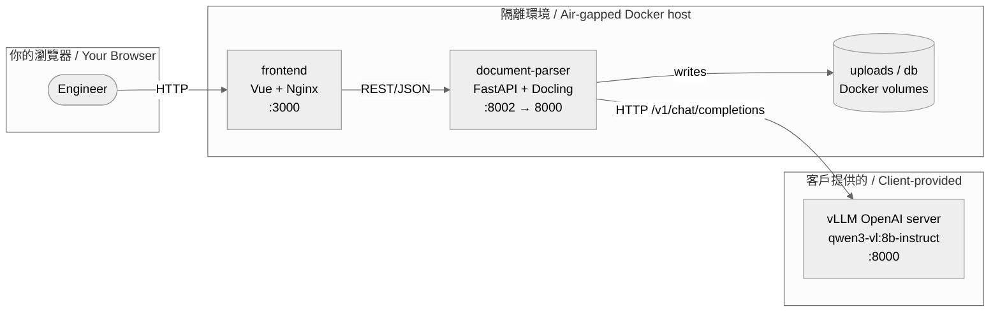
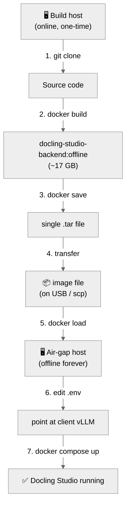

# Docling Studio — Air-Gapped Deployment Guide (中英對照)

> **Last verified against**: `docling-studio-backend:offline` image, commit on `main` branch (2026-06-26).
> **Audience**: customer's deployment engineer. Junior-friendly — assumes Docker basics, no prior Docling / vLLM experience.
> **Read time**: ~25 minutes. **Hands-on time**: ~90 minutes (mostly waiting for Docker build + image transfer).

---

## 目錄 / Table of Contents

1. [這份文件在做什麼 / What this guide does](#1-這份文件在做什麼--what-this-guide-does)
2. [架構總覽 / Architecture overview](#2-架構總覽--architecture-overview)
3. [前置準備 / Prerequisites](#3-前置準備--prerequisites)
4. [整體流程 / End-to-end flow](#4-整體流程--end-to-end-flow)
5. [步驟 1：複製專案 / Step 1: Clone the repo](#5-步驟-1複製專案--step-1-clone-the-repo)
6. [步驟 2：建立離線映像檔 / Step 2: Build the offline image](#6-步驟-2建立離線映像檔--step-2-build-the-offline-image)
7. [步驟 3：匯出映像檔成檔案 / Step 3: Export the image to a file](#7-步驟-3匯出映像檔成檔案--step-3-export-the-image-to-a-file)
8. [步驟 4：傳輸到隔離環境 / Step 4: Transfer to the air-gapped environment](#8-步驟-4傳輸到隔離環境--step-4-transfer-to-the-air-gapped-environment)
9. [步驟 5：在隔離環境載入映像檔 / Step 5: Load the image on the air-gap host](#9-步驟-5在隔離環境載入映像檔--step-5-load-the-image-on-the-air-gap-host)
10. [步驟 6：修改 .env 檔案 / Step 6: Edit the .env file](#10-步驟-6修改-env-檔案--step-6-edit-the-env-file)
11. [步驟 7：啟動系統 / Step 7: Bring up the stack](#11-步驟-7啟動系統--step-7-bring-up-the-stack)
12. [步驟 8：驗證 / Step 8: Verify it works](#12-步驟-8驗證--step-8-verify-it-works)
13. [日常操作 / Day-2 operations](#13-日常操作--day-2-operations)
14. [常見問題 / Troubleshooting](#14-常見問題--troubleshooting)
15. [附錄 / Appendix](#15-附錄--appendix)

---

## 1. 這份文件在做什麼 / What this guide does

這份指南帶你從零開始，把 Docling Studio 部署到**完全沒有外網**的 Docker 環境。我們會在**有網路的一台機器**（build host）把整個後端 + 模型打包成一個 Docker image，再把這個 image 搬進**隔離環境**（air-gap host）並啟動。

This guide walks you through deploying Docling Studio into a **fully air-gapped** Docker environment. We build the entire backend (code + ML models) into a single Docker image on a **machine with internet** (the build host), transfer that image into the **isolated environment** (the air-gap host), and start it up there.

### 為什麼要這麼麻煩？/ Why this dance?

| 階段 / Phase | 需要網路？/ Internet needed? | 做什麼 / What happens |
|---|---|---|
| Build host | ✅ Yes (one-time) | Pull source code, download ML models, bake everything into image |
| Image file | ❌ No | The image is self-contained — no model downloads at runtime |
| Air-gap host | ❌ No | Just runs the image. vLLM is provided by the client separately. |

Docling 在第一次跑轉檔時會自動去 Hugging Face 下載約 1.5 GB 的模型（layout、TableFormer、EasyOCR、picture classifier 等）。在沒網路的環境就會直接失敗。我們的解法是：**build 階段就把模型烤進 image 裡**，runtime 永遠不再連外網。

Docling auto-downloads ~1.5 GB of ML models on first conversion (layout, TableFormer, EasyOCR, picture classifier, …). Without internet, that fails. Our fix: **bake the models into the image at build time** — the runtime never touches the network.

---

## 2. 架構總覽 / Architecture overview

部署完成後，你的 air-gap 環境裡會跑這些容器：

After deployment, your air-gap environment runs these containers:



**重要**：`vLLM` 是客戶自己架的（不在這個 image 裡）。後端只透過 HTTP 跟它講話，所以 image 裡不需要打包任何模型權重。

**Important**: `vLLM` is hosted by the client (NOT inside our image). The backend talks to it over HTTP, so no model weights need to live inside our image.

---

## 3. 前置準備 / Prerequisites

### 3.1 你會用到兩台機器 / You need two machines

| 機器 / Machine | 作業系統 / OS | 需要什麼 / What's needed |
|---|---|---|
| **Build host**（有網路） | Linux / macOS / Windows + WSL2 | Docker 24+, Git, ~25 GB 可用磁碟, **能上網** |
| **Air-gap host**（隔離環境） | Linux（建議）/ Windows Server + Docker Desktop | Docker 24+, ~20 GB 可用磁碟, **不能上網** |

> 💡 **Why two machines?** The build host needs internet exactly once to download ML models. Once the image is baked, it never needs the network again. The air-gap host never needs internet at all — it only talks to the client-hosted vLLM over your internal network.

### 3.2 工具確認 / Verify your tools

在 build host 上執行 / Run on the **build host**:

```bash
# Linux / macOS / WSL2 (bash)
docker --version       # 期望 >= 24.0  / expect >= 24.0
git --version          # 任何版本  / any version
df -h .                # 至少有 25 GB 可用  / at least 25 GB free
```

```powershell
# Windows (PowerShell)
docker --version
git --version
Get-PSDrive C | Select-Object Used,Free
```

### 3.3 客戶會提供給你 / What the client provides

| 項目 / Item | 說明 / Description | 範例 / Example |
|---|---|---|
| vLLM endpoint URL | OpenAI 相容 API 的網址 / OpenAI-compatible API URL | `http://vllm-client.internal:8000/v1` |
| vLLM model name | vLLM 對外宣稱的模型別名 / Alias served by vLLM | `qwen3-vl:8b-instruct` |
| （選用）Neo4j 密碼 / Neo4j password | 圖資料庫密碼 / Graph DB password | `<由客戶提供>` |

> ⚠️ **重要**：`vLLM model name` 必須是 `qwen3-vl:8b-instruct`（不是 `qwen3-vl:8b`）。少了 `-instruct` 後綴，模型會輸出推理而不給答案。詳見後面的「常見問題」。

> ⚠️ **Important**: The `vLLM model name` MUST be `qwen3-vl:8b-instruct` (NOT `qwen3-vl:8b`). Without the `-instruct` suffix, the model dumps reasoning instead of giving an answer. See "Troubleshooting" below.

### 3.4 檔案傳輸通道 / File transfer channel

把 ~17 GB 的 image 從 build host 搬到 air-gap host。常用方式：

You need to move a ~17 GB image between the two hosts. Common channels:

| 方式 / Method | 適用場景 / When to use |
|---|---|
| USB 隨身碟 / USB stick | 實體隔離、無網路連線 / Physically isolated, no network |
| 內網 `scp` / `rsync` | 兩台機器在同一個內網 / Both hosts on the same internal network |
| 燒錄到光碟 / Burn to DVD | 監管要求唯寫媒體 / Compliance requires write-once media |

---

## 4. 整體流程 / End-to-end flow



---

## 5. 步驟 1：複製專案 / Step 1: Clone the repo

> 在 **build host** 上做 / Do this on the **build host**.

```bash
git clone <REPO_URL> docling-studio
cd docling-studio
```

把 `<REPO_URL>` 換成客戶（或你的 Git server）給你的網址。

Replace `<REPO_URL>` with the address your Git admin gave you.

**驗證 / Verify**:

```bash
ls -1
# 你應該看到 / You should see:
#   Dockerfile  document-parser  docker-compose.yml  frontend  ...
```

---

## 6. 步驟 2：建立離線映像檔 / Step 2: Build the offline image

> 在 **build host** 上做（需要網路，僅此一次）/ Do this on the **build host** (needs internet, one time only).

### 6.1 Build 指令 / Build command

```bash
docker build \
    --target local \
    -t docling-studio-backend:offline \
    -f document-parser/Dockerfile \
    document-parser/
```

**參數說明 / What the flags mean**:

| 旗標 / Flag | 用途 / Purpose |
|---|---|
| `--target local` | 用 Docling **in-process** 那個 build target（不是 remote 那個） |
| `-t docling-studio-backend:offline` | 給 image 一個好認的名字和 tag |
| `-f document-parser/Dockerfile` | 指定 backend 的 Dockerfile |
| `document-parser/` | build context（最後那個路徑） |

### 6.2 等它跑完 / Wait for it to finish

第一次 build 需要 **15–40 分鐘**，因為會下載 ~1.5 GB 的 Docling 模型。你會看到一連串 `[docling-bake]` 開頭的訊息 — 那是模型下載的進度。

The first build takes **15–40 minutes** because it downloads ~1.5 GB of Docling models. You'll see lines starting with `[docling-bake]` — that's the model download progress.

> 💡 **耐心點 / Be patient**: 不要中斷 build。中斷的話下次 build 要從頭來。

### 6.3 驗證 image 內含模型 / Verify the models are baked in

```bash
docker run --rm docling-studio-backend:offline \
    ls -1 /opt/docling/models
```

**預期輸出 / Expected output**（節錄 / excerpt）:

```
ds4sd--docling-models
EasyOcr
ds4sd--CodeFormula
ds4sd--pic2doc
...
```

如果目錄是空的或報錯，回去檢查 step 6.1 的 build log。

If the directory is empty or errors out, go back and check the build log from step 6.1.

### 6.4 確認 image 沒有對外連線 / Confirm no network calls at runtime

```bash
# 把 image 跑起來，嘗試 import Docling 的 converter
docker run --rm --network=none docling-studio-backend:offline \
    python -c "from docling.document_converter import DocumentConverter; \
    c = DocumentConverter(); print('converter built OK, no network needed')"
```

**預期輸出 / Expected**: `converter built OK, no network needed`。
如果出現 `downloads disabled` 或 timeout 訊息，代表模型沒正確烤入，**不要繼續**，回去查 build log。

If you see `downloads disabled` or timeouts, the models weren't baked in correctly — **don't proceed**, go back to the build log.

### 6.5 確認 image 大小 / Check image size

```bash
docker images --filter reference=docling-studio-backend
```

**預期 / Expected**:

```
REPOSITORY              TAG       SIZE
docling-studio-backend  offline   17GB
```

如果大小差很多（例如 < 10 GB），build 可能中途失敗。

If the size is way off (e.g. < 10 GB), the build probably failed midway.

---

## 7. 步驟 3：匯出映像檔成檔案 / Step 3: Export the image to a file

> 在 **build host** 上做 / Do this on the **build host**.

```bash
# Linux / macOS / WSL2
docker save -o docling-studio-backend-offline.tar docling-studio-backend:offline
gzip docling-studio-backend-offline.tar
# 最終檔案 / Final file: docling-studio-backend-offline.tar.gz  (約 7–9 GB)
```

```powershell
# Windows (PowerShell)
docker save -o docling-studio-backend-offline.tar docling-studio-backend:offline
# 用 7-Zip 或類似工具壓縮 / Use 7-Zip or similar to compress
# 最終檔案 / Final file: docling-studio-backend-offline.tar.gz  (約 7–9 GB)
```

**驗證 / Verify**:

```bash
ls -lh docling-studio-backend-offline.tar.gz
# 應該看到 7–9 GB 左右
```

---

## 8. 步驟 4：傳輸到隔離環境 / Step 4: Transfer to the air-gapped environment

依照你的基礎設施選一個 / Pick one based on your infrastructure:

| 方式 / Method | 指令 / Command |
|---|---|
| USB 隨身碟 / USB stick | 把 .tar.gz 複製到 USB，再插到 air-gap host |
| `scp` 內網傳輸 / `scp` over internal network | `scp docling-studio-backend-offline.tar.gz user@airgap-host:/tmp/` |
| 共用檔案伺服器 / Shared file server | 複製到 air-gap host 能讀到的路徑，例如 `\\fileserver\deploy\` |

> 💡 **建議 / Recommendation**: 用 `sha256sum` 算一下 hash，傳完在另一邊再算一次，確認檔案沒損壞。

> 💡 **Recommended**: Compute the SHA-256 hash before and after transfer to verify integrity.

```bash
# Build host
sha256sum docling-studio-backend-offline.tar.gz
# 把這串 hash 抄下來 / Note down this hash
```

在 air-gap host 上 / On the air-gap host:

```bash
sha256sum docling-studio-backend-offline.tar.gz
# 比對兩邊的 hash 是否一致 / Compare with the build host's hash
```

---

## 9. 步驟 5：在隔離環境載入映像檔 / Step 5: Load the image on the air-gap host

> 在 **air-gap host** 上做 / Do this on the **air-gap host**.

```bash
# Linux / macOS
gunzip -k docling-studio-backend-offline.tar.gz
docker load -i docling-studio-backend-offline.tar
rm docling-studio-backend-offline.tar
```

```powershell
# Windows (PowerShell) — 先用 7-Zip 解壓成 .tar，再用 docker load
docker load -i docling-studio-backend-offline.tar
```

**驗證 / Verify**:

```bash
docker images --filter reference=docling-studio-backend
# 應該看到 offline tag，size 17GB / Should show the offline tag, size 17GB
```

---

## 10. 步驟 6：修改 .env 檔案 / Step 6: Edit the .env file

> 在 **air-gap host** 上做 / Do this on the **air-gap host**.

### 10.1 準備專案目錄 / Prepare a project directory

因為 air-gap host 沒辦法 `git clone`（沒網路），你要把幾個必要的檔案從 build host 一起搬過來：

The air-gap host can't `git clone` (no internet), so you need to bring a few files from the build host too:

| 必要檔案 / Required files | 用途 / Purpose |
|---|---|
| `docker-compose.yml` | 主 compose 檔 / Main compose file |
| `docker-compose.dev.yml` | 含 vLLM 的 dev compose（**airgap 不需要 vLLM**，但要它的 `DOCLING_ARTIFACTS_PATH` 等設定當參考） |
| `.env.example` | 環境變數範本 / Env var template |
| `frontend/` | 前端 build 出來的靜態檔（如果你用 production compose）/ Frontend static build (if using prod compose) |

> ⚠️ **簡化做法 / Simplified approach**: 為了避免搬一堆檔案，建議直接在 air-gap host 上手寫一份精簡版的 `docker-compose.yml` 和 `.env`。下面給範本。

> ⚠️ **Simplified approach**: To avoid moving lots of files, write a minimal `docker-compose.yml` and `.env` directly on the air-gap host. Templates below.

### 10.2 建立 airgap compose 檔 / Create the airgap compose file

建立 `docker-compose.airgap.yml`（或直接覆蓋 `docker-compose.yml`）：

Create `docker-compose.airgap.yml` (or overwrite `docker-compose.yml`):

```yaml
# =============================================================================
# Docling Studio — Air-gap deployment
# 客戶提供 vLLM，本機不跑任何 LLM 容器。
# Client provides vLLM, no LLM container runs locally.
# =============================================================================
services:
  # --- Backend (FastAPI) ---
  document-parser:
    image: docling-studio-backend:offline   # 從 build host 載入的 image / loaded from build host
    container_name: docling-studio-backend
    restart: unless-stopped
    ports:
      - "8002:8000"     # 對外開 8002，避免與客戶的 vLLM :8000 衝突 / use 8002 to avoid clashing with client vLLM :8000
    volumes:
      - uploads_data:/app/uploads
      - db_data:/app/data
    env_file:
      - .env
    healthcheck:
      test: ["CMD-SHELL", "curl -sf http://localhost:8000/api/health || exit 1"]
      interval: 30s
      timeout: 10s
      retries: 5
      start_period: 60s

  # --- Frontend ---
  # 兩個選項：
  # (A) 從 build host 把 frontend/ 整包搬過來 build → 用 build: context
  # (B) 預先在 build host build 成靜態檔，用 nginx 跑 → 用 image:
  # Two options:
  # (A) Move frontend/ to air-gap host and build there → use build: context
  # (B) Pre-build static files on build host, serve via nginx → use image:
  frontend:
    image: nginx:alpine
    container_name: docling-studio-frontend
    restart: unless-stopped
    ports:
      - "3000:80"
    volumes:
      - ./frontend/dist:/usr/share/nginx/html:ro
      - ./frontend/nginx-airgap.conf:/etc/nginx/conf.d/default.conf:ro
    depends_on:
      document-parser:
        condition: service_healthy

volumes:
  uploads_data:
  db_data:
```

> 💡 **前端選擇 / Frontend choice**: 如果你不熟 frontend build，請跳到「[15.2 附錄：frontend 怎麼 build](#152-附錄frontend-怎麼build--appendix-how-to-build-the-frontend)」先看說明。

> 💡 **Frontend choice**: If you're not familiar with frontend builds, jump to "[15.2 Appendix: how to build the frontend](#152-附錄frontend-怎麼build--appendix-how-to-build-the-frontend)" first.

### 10.3 建立 `.env` 檔 / Create the `.env` file

把下面的範本存成 `.env`，然後**填入客戶給你的真實值**：

Save the template below as `.env`, then **fill in the real values from the client**:

```dotenv
# =============================================================================
# Docling Studio — Air-gap production .env
# 必填的欄位都已用 <ANGLE_BRACKETS> 標示。沒標示的保留預設即可。
# Required fields are marked with <ANGLE_BRACKETS>. Leave others at default.
# =============================================================================

# --- vLLM (客戶提供 / client-provided) ----------------------------------------
# 客戶給你的 vLLM OpenAI 相容 API URL（含 /v1）
# The vLLM OpenAI-compatible API URL the client gave you (include /v1)
OPENAI_BASE_URL=<CLIENT_VLLM_URL>/v1

# VLM 路徑。預設跟 OPENAI_BASE_URL 一樣，但有些客戶會把 VLM 開在不同 port。
# VLM endpoint. Same as chat by default, but the client may expose VLM on a different port.
VLM_OPENAI_URL=<CLIENT_VLLM_URL>/v1/chat/completions

# vLLM 對外宣稱的模型名稱 — 必須完全等於 qwen3-vl:8b-instruct
# Model alias served by vLLM — must equal qwen3-vl:8b-instruct exactly
CHAT_MODEL_ID=qwen3-vl:8b-instruct

# 用 OpenAI 相容模式（不要改成 ollama）/ Use OpenAI-compat mode (do not change to ollama)
CHAT_PROVIDER=openai

# vLLM 通常不需要 API key；如有，客戶會提供 / Most vLLM servers don't need a key; client will provide if needed
OPENAI_API_KEY=

# --- Docling model artifacts（已烤進 image，不需改）-----------------------------
# Docling model artifacts (baked into image, no change needed)
DOCLING_ARTIFACTS_PATH=/opt/docling/models

# --- 部署設定 / Deployment settings --------------------------------------------
# 對外開放 CORS 的來源；改成你的瀏覽器會用的網址
# Allowed CORS origins; set to the URL your browser will use
CORS_ORIGINS=http://localhost:3000

# 上傳檔案大小上限 / Max upload size in MB
MAX_FILE_SIZE_MB=50

# 單次轉檔逾時秒數 / Per-conversion timeout in seconds
CONVERSION_TIMEOUT=3600

# Fernet 密鑰（用來加密儲存的憑證）。生成方式見註解。
# Fernet key for store-credential encryption. Generate as shown in the comment.
#   python -c "from cryptography.fernet import Fernet; print(Fernet.generate_key().decode())"
STORE_SECRET_KEY=<RUN_PYTHON_ONELINE_TO_GENERATE>

# --- VLM 設定 / VLM settings ---------------------------------------------------
VLM_BACKEND=ollama
VLM_OLLAMA_MODEL=qwen3-vl:8b-instruct
```

### 10.4 怎麼生成 STORE_SECRET_KEY / How to generate STORE_SECRET_KEY

這個 key 用來加密存在資料庫裡的憑證（如果有設定 OpenSearch / Neo4j 連線的話）。**必須保持穩定**，換了 key 會讓舊資料無法解密。

This key encrypts stored credentials (e.g. OpenSearch / Neo4j credentials). **Must stay stable** — changing it invalidates all old data.

**如果 air-gap host 完全沒裝 Python**：在 build host 上跑一次，把輸出貼過來。

**If the air-gap host has no Python**: run once on the build host and paste the output.

```bash
# 在 build host（有 Python 的任何地方）上
python -c "from cryptography.fernet import Fernet; print(Fernet.generate_key().decode())"
```

會得到類似 / You'll get something like:

```
b'kFm9X2vN8pQ3rT6yU4wZ1aB5cD7eF0gH='
```

把這個字串貼到 `.env` 的 `STORE_SECRET_KEY=` 後面。**找個地方備份**，未來重 deploy 時需要同一把 key。

Paste that string after `STORE_SECRET_KEY=` in `.env`. **Back it up somewhere** — future re-deployments need the same key.

### 10.5 確認 .env 沒被 commit / Confirm .env isn't committed

`.env` 已經在 `.gitignore` 裡了，但如果 air-gap host 上沒有 `.git`，這步可以跳過。

`.env` is in `.gitignore`, but if the air-gap host has no `.git`, skip this step.

---

## 11. 步驟 7：啟動系統 / Step 7: Bring up the stack

> 在 **air-gap host** 上做 / Do this on the **air-gap host**.

```bash
# 啟動 / Bring up
docker compose -f docker-compose.airgap.yml up -d

# 看 log / Tail logs
docker compose -f docker-compose.airgap.yml logs -f document-parser
```

> 第一次啟動 backend 時，Docling 會掃描 `/opt/docling/models` 載入模型到記憶體，**大約 30–60 秒**是正常的。

> The first time the backend starts, Docling scans `/opt/docling/models` to load the models into memory. **30–60 seconds** is normal.

**驗證 container 健康 / Verify container health**:

```bash
docker compose -f docker-compose.airgap.yml ps
# 兩個 service 都應該是 "healthy" 或 "Up"
# Both services should show "healthy" or "Up"
```

---

## 12. 步驟 8：驗證 / Step 8: Verify it works

### 12.1 Backend health check

```bash
curl http://localhost:8002/api/health
# 預期 / Expected: {"status":"ok",...}
```

### 12.2 確認 backend 可以連到客戶的 vLLM / Confirm backend can reach the client's vLLM

```bash
# 進 backend container 看一眼
docker exec -it docling-studio-backend env | grep -E "OPENAI_BASE_URL|VLM_OPENAI"
# 應該看到你剛剛填的 URL / Should show the URL you just filled in
```

### 12.3 開瀏覽器 / Open the browser

打開 / Open: **http://localhost:3000**

應該看到 Docling Studio 的上傳頁面。試著上傳一個小 PDF（5 頁以內），確認能正常轉檔。

You should see Docling Studio's upload page. Try uploading a small PDF (≤ 5 pages) and confirm it converts normally.

### 12.4 測試 Ask 功能 / Test the Ask feature

1. 上傳並解析一個 PDF / Upload and parse a PDF
2. 切到 **Ask** tab / Switch to the **Ask** tab
3. 輸入一個問題，例如 "summarize this document" / Ask a question like "summarize this document"
4. 確認收到 stream 回來的答案 / Confirm you get a streamed answer

如果 ask 沒回應，去 backend log 看有沒有 vLLM connection 錯誤。

If Ask doesn't respond, check the backend log for vLLM connection errors.

---

## 13. 日常操作 / Day-2 operations

### 13.1 停機 / Shut down

```bash
docker compose -f docker-compose.airgap.yml down
# 想連上傳和資料庫一起清掉的話 / To also wipe uploads and DB:
docker compose -f docker-compose.airgap.yml down -v
```

### 13.2 升級到新版本 / Upgrade to a new version

```bash
# 1. 在 build host 重新 build 新 image (tag 用新版本號)
#    On the build host, rebuild with a new tag
docker build --target local \
    -t docling-studio-backend:v2 \
    -f document-parser/Dockerfile document-parser/

# 2. docker save + 傳輸 + docker load (重複 step 3–5)
#    Repeat steps 3–5: docker save → transfer → docker load

# 3. 在 air-gap host 上更新 compose 檔的 image tag 並重啟
#    On the air-gap host, update the image tag in the compose file and restart
docker compose -f docker-compose.airgap.yml pull   # 不適用本地 image，可跳過 / not applicable for local images, can skip
docker compose -f docker-compose.airgap.yml up -d
```

### 13.3 看 log / View logs

```bash
docker compose -f docker-compose.airgap.yml logs -f --tail=200 document-parser
```

### 13.4 備份 / Backup

需要備份的只有 Docker volume：

Only Docker volumes need backing up:

```bash
# 上傳檔案 / Uploads
docker run --rm -v uploads_data:/data -v $(pwd):/backup \
    alpine tar czf /backup/uploads-backup-$(date +%F).tar.gz /data

# 資料庫 / Database
docker run --rm -v db_data:/data -v $(pwd):/backup \
    alpine tar czf /backup/db-backup-$(date +%F).tar.gz /data
```

---

## 14. 常見問題 / Troubleshooting

### 14.1 Image build 失敗 / Image build fails

| 症狀 / Symptom | 原因 / Cause | 解法 / Fix |
|---|---|---|
| `pip install docling-tools` 失敗 | 套件名稱錯 / Wrong package name | 用 `pip install "docling[easyocr]"`（已在 Dockerfile 修好） |
| `downloads disabled` 訊息 | 模型沒下載完 / Models didn't finish downloading | 確認 build host 沒被 proxy 擋；重 build |
| Build 卡住超過 1 小時 | Hugging Face rate limit | 重 build，或換個時段再 build |
| `no space left on device` | 磁碟空間不足 / Disk full | 清掉舊 image (`docker image prune`) |

### 14.2 Container 啟動後立刻掛掉 / Container crashes on start

```bash
docker logs docling-studio-backend
```

常見原因 / Common causes:

| Log 訊息 / Log message | 解法 / Fix |
|---|---|
| `DOCLING_ARTIFACTS_PATH must point to ... parent dir` | 不要改這個 env var，image 裡已經是對的 / Don't change this env var, the image already has it right |
| `Connection refused to vllm ...` | `.env` 裡的 vLLM URL 填錯 / Wrong vLLM URL in `.env` |
| `STORE_SECRET_KEY is required` | 沒填 STORE_SECRET_KEY / Missing STORE_SECRET_KEY |

### 14.3 Ask 功能回 404 / Ask returns 404

代表 vLLM 找不到對應的模型名稱。檢查：

Means vLLM doesn't recognize the model name. Check:

```bash
# 在 air-gap host 上直接問 vLLM（換成你的真實 URL）
curl http://<CLIENT_VLLM_URL>/v1/models
```

回傳的 `id` 必須**完全等於** `.env` 裡的 `CHAT_MODEL_ID`（預設 `qwen3-vl:8b-instruct`）。

The `id` returned must **exactly equal** `CHAT_MODEL_ID` in `.env` (default `qwen3-vl:8b-instruct`).

> 🔥 **常見陷阱 / Common trap**: 客戶的 vLLM 可能用 `--served-model-name=qwen3-vl:8b-instruct` 但底層 HF model 是 `cyankiwi/Qwen3-VL-8B-Instruct-AWQ-4bit`。這是正常的——你只要管 `qwen3-vl:8b-instruct` 這個 alias。

> 🔥 **Common trap**: The client's vLLM might use `--served-model-name=qwen3-vl:8b-instruct` while the underlying HF model is `cyankiwi/Qwen3-VL-8B-Instruct-AWQ-4bit`. That's normal — you only care about the `qwen3-vl:8b-instruct` alias.

### 14.4 解析 PDF 報 "model not found" / PDF parse fails with "model not found"

```bash
docker exec docling-studio-backend ls /opt/docling/models
```

應該列出至少 / Should list at least:

```
ds4sd--docling-models  EasyOcr  ds4sd--CodeFormula  ...
```

如果沒有 → image 沒烤好，重 build。

If empty → image wasn't baked correctly, rebuild.

### 14.5 連不到客戶的 vLLM / Can't reach client's vLLM

從 air-gap host 直接測：

Test directly from the air-gap host:

```bash
curl -v http://<CLIENT_VLLM_URL>/v1/models
```

- 連得到 → 檢查 `.env` 的 URL 有沒有打錯（注意 `/v1` 結尾）
- 連不到 → 確認你的網路有沒有路由到客戶 vLLM（可能被防火牆擋）

- Works → check the URL in `.env` (especially the trailing `/v1`)
- Doesn't work → check your network routing to client's vLLM (might be firewall-blocked)

### 14.6 升級後舊資料讀不到 / Old data unreadable after upgrade

`STORE_SECRET_KEY` 換了。每個環境必須固定同一把 key，換了等於強制 reset 所有加密欄位。

You changed `STORE_SECRET_KEY`. Each environment must use the same key forever — changing it forces a reset of all encrypted fields.

### 14.7 Port 衝突 / Port conflicts

| Port | 誰在用 / Used by | 解法 / Fix |
|---|---|---|
| 8000 | **vLLM**（客戶那邊的）/ client's vLLM | Backend 已經用 8002，不用改 |
| 3000 | Frontend（我們的）/ our frontend | 如果衝突，改 compose 裡的 `ports: "8080:80"` |

---

## 15. 附錄 / Appendix

### 15.1 檔案佈局 / File layout on the air-gap host

```
/opt/docling-studio/                ← 你部署的根目錄 / your deployment root
├── docker-compose.airgap.yml       ← step 10.2 寫的 / from step 10.2
├── .env                            ← step 10.3 寫的 / from step 10.3
├── frontend/
│   ├── dist/                       ← 前端靜態檔（從 build host 搬來）/ static files (moved from build host)
│   └── nginx-airgap.conf           ← nginx config
└── (Docker volumes 由 Docker 自己管理)
    (Docker volumes managed by Docker)
```

### 15.2 附錄：frontend 怎麼 build / Appendix: how to build the frontend

> 這一步在 **build host** 上做（需要 Node.js 和網路下載 npm packages）。

> Do this on the **build host** (needs Node.js and internet for npm packages).

```bash
cd frontend
npm install              # 5–10 分鐘，第一次 / 5–10 min on first run
npm run build            # 產出 dist/ 目錄 / produces dist/ directory
```

把 `dist/` 整個目錄搬去 air-gap host 的 `<deploy-root>/frontend/dist/`。

Move the entire `dist/` directory to `<deploy-root>/frontend/dist/` on the air-gap host.

**最小 nginx config**（存成 `<deploy-root>/frontend/nginx-airgap.conf`）：

**Minimal nginx config** (save as `<deploy-root>/frontend/nginx-airgap.conf`):

```nginx
server {
    listen 80;
    server_name _;
    root /usr/share/nginx/html;
    index index.html;

    # SPA fallback: 所有沒對應檔案的路徑都回 index.html
    # SPA fallback: any path that doesn't match a file returns index.html
    location / {
        try_files $uri $uri/ /index.html;
    }

    # API proxy: 把 /api/* 轉給 backend
    # API proxy: forward /api/* to backend
    location /api/ {
        proxy_pass http://docling-studio-backend:8000/api/;
        proxy_set_header Host $host;
        proxy_set_header X-Real-IP $remote_addr;
        proxy_http_version 1.1;
        proxy_read_timeout 600s;     # 大檔案轉檔需要 / long conversions need this
    }

    client_max_body_size 200M;
}
```

### 15.3 客戶會問的常見問題 / FAQ from the client

**Q: 我們能換成 K8s 部署嗎？/ Can we deploy on K8s instead of Docker Compose?**

A: 可以，把 `docker-compose.airgap.yml` 的 services 轉成 K8s Deployment + Service 即可。image 一樣用 `docling-studio-backend:offline`。

Yes — convert each service in `docker-compose.airgap.yml` into a K8s Deployment + Service. The image (`docling-studio-backend:offline`) works the same.

**Q: 我們能從 air-gap host 直接訪問嗎？/ Can we access it directly from the air-gap host?**

A: 用 `http://<air-gap-host>:3000`。如果 air-gap host 沒有 GUI，就從同網段的機器訪問。

Use `http://<air-gap-host>:3000`. If the air-gap host is headless, access from another machine on the same network.

**Q: 之後升級需要重新烤模型嗎？/ Do we need to re-bake models on every upgrade?**

A: 不需要。模型已經是 image 的一部分了，只要 Dockerfile 的 `docling-tools models download ...` 那段沒改，新 build 會直接用 HF cache 跳過下載（~3 分鐘 rebuild）。

No. The models are part of the image. As long as the `docling-tools models download ...` line in the Dockerfile hasn't changed, new builds reuse the HF cache and skip the download (~3 min rebuild).

**Q: 我們能換 LLM 模型嗎？/ Can we swap the LLM?**

A: 可以，但要動 code——`_SYSTEM_PROMPT` 是針對 4-section schema 寫死的。換模型只是把 `CHAT_MODEL_ID` 改成 vLLM 那邊的 alias，不需要重新 build image。

Yes, but the `_SYSTEM_PROMPT` is hardcoded for the 4-section schema. Just change `CHAT_MODEL_ID` to whatever alias your vLLM exposes — no need to rebuild the image.

### 15.4 緊急還原 / Emergency rollback

如果新版跑不起來，最快的還原方式是回到上一個 image：

If a new version breaks, the fastest rollback is to the previous image:

```bash
# 在 build host 把上一個 tag 重新匯出
docker save -o docling-studio-backend-v1.tar docling-studio-backend:v1

# 走 step 4–7 的流程，只是 image tag 換成 v1
# Repeat steps 4–7 but with the v1 tag

# 在 air-gap host 改 compose 檔的 image tag，例：
# On the air-gap host, change the image tag in the compose file, e.g.:
#   image: docling-studio-backend:offline
# 改成 / change to:
#   image: docling-studio-backend:v1

docker compose -f docker-compose.airgap.yml up -d
```

### 15.5 聯絡資訊 / Contact

技術問題 / Technical questions:
- 後端 / Backend: 看 `document-parser/AGENTS.md`
- 部署 / Deployment: 看 `docs/design/offline-deployment.md`（內部設計文件）

For technical questions:
- Backend: see `document-parser/AGENTS.md`
- Deployment internals: see `docs/design/offline-deployment.md`

---

## 變更紀錄 / Change log

| 日期 / Date | 版本 / Version | 變更 / Change |
|---|---|---|
| 2026-06-26 | 1.0 | 初版：clone → build → transfer → .env → up 全流程 / Initial release: full clone → build → transfer → .env → up walkthrough |

